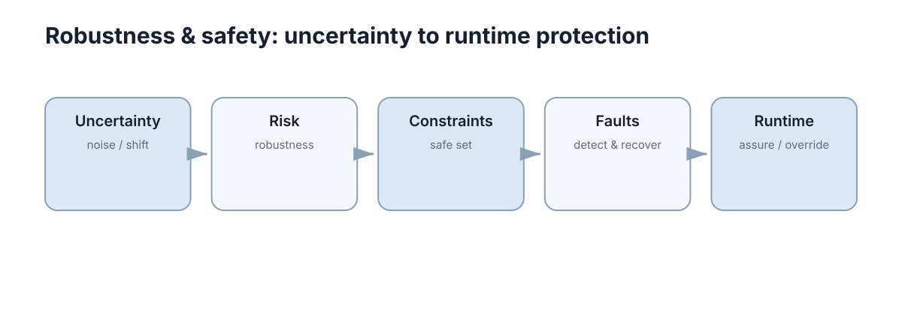

# Robustness & Safety

这一节处理自主系统里最不能靠“调大奖励”解决的问题：**当条件变化、组件失效、模型不再可信时，系统靠什么保持可接受的行为。**

<figure markdown="span">
  
  <figcaption>五层防线从理解不确定性开始，最终落到运行时保护与覆盖。</figcaption>
</figure>

概念地图给出的主线是：**Uncertainty（noise / shift）→ Risk（robustness）→ Constraints（safe set）→ Faults（detect & recover）→ Runtime（assure / override）**。这是一条从“认识问题”到“强制保护”的递进链：前半部分回答“什么会让系统变差”，后半部分回答“当它真的变差时，谁能够阻止后果”。

## 本节要解决的问题

安全不是一个功能，而是一组可验证条件。下面这些问题如果没有明确答案，系统就还没有被工程化：

| 问题 | 若不回答会怎样 | 对应章节 |
|---|---|---|
| 扰动范围有多大 | 无法判断“鲁棒”是否成立 | [Uncertainty & Distribution Shift](./01-uncertainty-shift.md) |
| 尾部损失有多严重 | 平均值掩盖罕见崩溃 | [Robustness, Risk & Reliability](./02-robustness-risk.md) |
| 哪些状态原则上不允许 | 事后惩罚挡不住越界 | [Safety Constraints](./03-safety-constraints.md) |
| 组件坏了怎么发现 | 错误数据被继续使用 | [Fault Detection & Tolerance](./04-fault-tolerance.md) |
| 主策略不可信时谁兜底 | 失效直接变成事故 | [Safe Learning & Runtime Safety](./05-safe-learning-runtime.md) |

把“问题”翻译成“检查项”是本节的核心动作：每一条防线都必须能用**数值 + 阈值 + 适用范围**三要素描述，否则它只是口号。下表给出五层防线各自的典型失败形态与最小检查项：

| 防线层 | 典型失败 | 最小检查项 | 通过判据（示例） |
|---|---|---|---|
| Uncertainty | 只统计名义噪声，忽略分布偏移 | 扰动集合与偏移程度的定义 | 偏移强度 $\epsilon$ 有明确上下界 |
| Risk | 只报平均损失，忽略尾部 | 分位数与 $\mathrm{CVaR}$ 报告 | $\mathrm{CVaR}_{0.95}$ 不超过阈值 |
| Constraints | 约束写成软惩罚 | 硬约束集合与余量计算 | 余量 $\ge$ 制动距离 + 估计误差 |
| Faults | 只有检测没有降级路径 | 检测延迟与隔离策略 | 检测延迟 $\le 200$ ms |
| Runtime | 兜底逻辑从未被演练 | watchdog 与接管演练记录 | 接管成功率 100%，可重复 |
| Interface | 仿真与实机的语义悄悄分叉 | 接口契约与字段对照表 | 迁移改动行数 $\le 5$ |

注意最后两行的顺序：**检测先于隔离，隔离先于降级**。任何跳步都会让故障在系统内部继续传播，等到降级被触发时，错误状态可能已经被写入地图或控制回路。

## 五章的推进逻辑与时间尺度

| 章 | 关注点 | 核心输出 | 时间尺度 |
|---|---|---|---|
| 01 | 不确定性的类型与来源 | 区分随机性、模型不确定性与分布偏移 | 离线分析 |
| 02 | 风险与可靠性度量 | $\mathrm{CVaR}$、$\mathrm{MTBF}$、安全/性能指标分离 | 离线评估 |
| 03 | 安全约束与可行域 | 硬/软约束、安全余量、运行时过滤 | 设计 + 在线 |
| 04 | 故障检测与容错 | 检测、隔离、降级、冗余 | 在线 |
| 05 | 运行时安全 | 监控、过滤、watchdog、状态机 | 在线（毫秒级） |

时间尺度是理解这五层的钥匙：**越靠后的章节响应越快、覆盖越窄；越靠前的章节周期越长、影响越广**。用离线评估的手段去解决毫秒级问题，或反过来用限幅去掩盖建模错误，都不会有效。

把时间尺度写成具体数量级，各层的能力边界就变得可讨论了：

| 层 | 典型响应时间 | 可覆盖的状态 | 典型实现 | 不能解决的问题 |
|---|---|---|---|---|
| 离线分析 | 天–周 | 全部标称场景 | 统计报告、可达集计算 | 运行时突发扰动 |
| 设计期约束 | 版本周期 | 设计裕度内的状态 | 约束形式化、余量预算 | 未建模的执行器故障 |
| 监督/过滤层 | 10–100 ms | 单步动作 | QP 安全过滤、控制屏障函数 | 传感器层面的错误输入 |
| 故障管理层 | 0.1–5 s | 组件级降级 | 超时、交叉校验、冗余切换 | 未检测到的共模失效 |
| 运行时保护 | 1–50 ms | 紧急状态 | 限幅、watchdog、急停 | 语义层面的错误决策 |
| 事后复盘 | 天–周 | 已发生的全部事件 | 事件分类与假设更新 | 未发生过的新场景 |

前两行的成本是时间，后三行的成本是算力与复杂度。工程上最常见的不平衡是**把预算全花在离线分析，却让运行时保护缺少独立通道**——一旦模型本身出错，整条链会同时失效，而失效模式无法被同源的方法发现。

## 概念地图

| 节点 | 含义 | 工程落点 |
|---|---|---|
| Uncertainty（noise / shift） | 随机噪声、参数未知、分布变化 | 区分偶然与认识不确定性 |
| Risk（robustness） | 变化之后性能掉多少、尾部多严重 | 分位数、$\mathrm{CVaR}$、条件风险 |
| Constraints（safe set） | 不允许越过的状态与动作边界 | 硬约束、余量、可行域收缩 |
| Faults（detect & recover） | 组件偏离正常并扩散为失效 | 检测、隔离、降级、冗余 |
| Runtime（assure / override） | 部署时的最后一道防线 | 监控、过滤、watchdog、回退 |

注意最后一层的动词是 **override（覆盖）**：运行时安全层有权否决主策略甚至否决人。接受这一点是设计能兜底的前提。

动词强度决定权限边界。用“能否否决”而不是“能否建议”来描述每一层，可以避免把安全寄托在协作意愿上：

| 层 | 动词 | 权限 | 失效时谁负责 | 常见越权 |
|---|---|---|---|---|
| Uncertainty | quantify | 只提出假设 | 建模者 | 用猜测替代测量 |
| Risk | evaluate | 给出风险数字 | 评估者 | 只报均值不报尾部 |
| Constraints | forbid | 缩小可行域 | 设计者 | 把硬约束降级为软惩罚 |
| Faults | isolate | 切断错误数据 | 系统本身 | 只报警不隔离 |
| Runtime | override | 否决主策略 | 系统本身 | 必须人工确认才生效 |
| Interface | guarantee | 冻结接口语义 | 接口所有者 | 只做单向迁移测试 |

最后一行是关键设计选择：**紧急动作若需要人工确认，人就成了延迟的一部分**，而人的反应时间通常在 0.5–2 s，远大于制动所需的时间尺度（多为 100–300 ms）。把否决权留给人类，等于把最坏情况下的响应时间交给最不确定的环节。

## 指标分层：安全与性能不能混用

一个系统可以同时“性能很好”和“不安全”，也可以“很安全”但“什么都不做”。因此指标必须分层，每层有各自的报告纪律。

先定义三个量：任务损失 $L$（越小越好）、扰动强度 $\epsilon$（偏离名义条件的程度）、约束函数 $g(x,u)$（$g > 0$ 表示越界）。风险度量的标准形式是条件风险价值：

$$\mathrm{CVaR}_{\alpha}(L) = \min_{t} \left[ t + \frac{1}{1-\alpha}\,\mathbb{E}\left[(L-t)^{+}\right] \right]$$

它回答的是“最差的 $1-\alpha$ 那一部分平均有多差”，而 $\mathbb{E}[L]$ 只回答“总体上怎么样”。两者可以给出完全相反的结论，这不是统计噪声，而是尾部形状本身的信息。

| 层 | 指标 | 定义 | 报告方式 | 常见误用 |
|---|---|---|---|---|
| 性能 | 成功率、完成时间 | 名义场景下的平均表现 | 均值 ± 标准差 | 用它证明安全 |
| 鲁棒性 | 性能下降率 $\Delta J / J_0$ | 扰动前后任务代价之比 | 扰动-性能曲线 | 只测单一扰动强度 |
| 尾部风险 | $\mathrm{CVaR}_{0.95}(L)$ | 最差 5% 情形的平均损失 | 分位数 + Bootstrap 区间 | 用样本不足的估计下结论 |
| 安全 | 违反次数、最小间距 $d_{\min}$ | 硬约束的实际越界情况 | 计数 + 极值 | 用平均值掩盖单次越界 |
| 可用性 | $\mathrm{MTBF}$、$\mathrm{MTTR}$ | 失效间隔与修复时间 | 小时/次、分钟/次 | 忽略共因故障 |
| 可恢复性 | 恢复时间 $t_{\mathrm{rec}}$ | 从降级回到标称的时间 | 分布而非均值 | 只测演练过的场景 |
| 稳健裕度 | $J_{0} - J_{\epsilon}$ | 扰动下的性能保留量 | 相对基准的比例 | 基准选择不写明 |

量化的对比：假设某次改动把平均损失从 $0.12$ 降到 $0.10$（改善 $17\%$），同时把 $\mathrm{CVaR}_{0.95}$ 从 $1.2$ 推到 $3.0$（恶化 $150\%$）。只报第一行时，这次改动会被描述为“性能提升”；而它实际上把最坏 5% 的后果放大了 2.5 倍。

| 变更类型 | 平均损失 | $\mathrm{CVaR}_{0.95}$ | 应如何描述 |
|---|---|---|---|
| 提高速度上限 | $0.10$ | $3.0$ | 尾部恶化，不能称改善 |

**报告纪律**：任何“改善”结论都必须同时给出对应的尾部指标，否则不允许进入结论。

## 场景化评测矩阵

评测覆盖度不能靠“跑了多少次”衡量，而要看**场景维度 × 扰动强度的矩阵是否被填满**。定义场景集合 $\mathcal{S}$ 与扰动档位集合 $\mathcal{E}$，覆盖率写作

$$\mathrm{Coverage} = \frac{\left|\{(s,e) : n(s,e) > 0\}\right|}{\left|\mathcal{S}\right| \cdot \left|\mathcal{E}\right|}$$

其中 $n(s,e)$ 是在场景 $s$、扰动档位 $e$ 下的有效试验次数。覆盖率小于 1 时，未填格子对应的是**未知风险**，而不是“安全”。

| 场景维度 | 典型取值 | 扰动档位 | 观察指标 | 通过判据（示例） |
|---|---|---|---|---|
| 光照 / 外观 | 白天、夜间、逆光 | 3 档 | 检测召回率 | 夜间 $\ge 90\%$ |
| 动态障碍 | 无 / 稀疏 / 拥挤 | 3 档 | 最小间距 $d_{\min}$ | 全程 $d_{\min} \ge 0.3$ m |
| 通信质量 | 正常 / 抖动 / 断连 | 3 档 | 降级触发时间 | $\le 300$ ms |
| 传感器失效 | 单目丢失、IMU 冻结 | 2 档 | 能否安全停车 | $100\%$ 成功 |
| 地形 / 摩擦 | 干燥、湿滑、坡道 | 3 档 | 跟踪误差 | $\le 0.1$ m |
| 速度档位 | $30\%$ / $60\%$ / $100\%$ | 3 档 | 成功率与制动距离 | 制动距离 < 余量 |
| 时间 / 负载 | 空载、满载 | 2 档 | 跟踪误差与电流 | 不超额定力矩 |
| 系统状态 | 冷启动、长时运行 | 2 档 | 漂移与温升 | 漂移在标定区间 |

矩阵的填法本身也有纪律：同一格子至少要 $20$–$30$ 次独立试验，才能对 $5\%$ 量级的事件率给出有意义的估计，否则“零失败”只意味着“没看到失败”。若要把零失败结论外推到 $10^{-4}$ 的失效概率，靠堆试验数量并不现实，必须引入分析证据或形式化论证。

两种典型偏差是**只扩场景维度不扩扰动强度**（矩阵很宽但很薄）和**只在最容易的档位堆样本**（矩阵很密但偏斜）。它们共同的后果是：上线后遇到的第一次真实扰动，会成为该系统历史上第一个测试用例。

矩阵还应标注**哪一格是“上线前必须为绿”的门槛格**。把所有格子同等对待，等于把有限预算平均分给低风险与高风险的组合。

## 与其他章节的接口

安全不是孤立的一层，它需要从其他章节借用形式化工具，并把结论还回去：

| 本节概念 | 对接章节 | 借什么 | 还什么 |
|---|---|---|---|
| 约束优化形式 | [Model Predictive Control](../control-theory/05-mpc.md) | 预测模型与在线求解 | 硬约束与余量预算 |
| 随机/鲁棒/机会约束 | [Optimization, Constraints & Uncertainty](../mathematics/06-optimization-under-uncertainty.md) | 不确定性集合的数学形式 | 可验证的可行性条件 |
| $\mathrm{CVaR}$ 与安全约束 | [Safe, Robust & Offline RL](../reinforcement-learning/06-safe-robust-offline.md) | 风险约束下的策略优化 | 训练期的风险上限 |
| 不确定性表达 | [Trust & Explainability](../human-ai-interaction/04-trust-explainability.md) | 置信度校准方法 | 可解释的失效原因 |
| 故障与超时重试 | [Fault Tolerance（分布式）](../distributed-systems/04-fault-tolerance.md) | 超时、重试、法定人数 | 安全相关的降级语义 |
| 安全退化与可回滚 | [Docker, CI & Reliability](../software-engineering/05-deployment-reliability.md) | 回滚与灰度能力 | 降级路径的验证需求 |

接口处最常见的错误是**只传递结论不传递假设**。例如把“$d_{\min} \ge 0.3$ m”写进需求，却没有同时写下“在制动延迟 $\le 80$ ms、位置估计误差 $\le 0.05$ m 的前提下”。假设一旦丢失，余量的来源就不可追溯，任何一处参数变更都可能悄悄吃掉它。

因此建议维护一张**假设-余量账本**，把安全相关的假设显式登记：

| 假设 | 典型量级 | 由谁提供 | 假设失效的后果 |
|---|---|---|---|
| 制动延迟 | $\le 80$ ms | 执行器/驱动 | 制动距离被低估 |
| 位置估计误差 | $\le 0.05$ m | 感知/定位 | 余量不足以覆盖偏置 |
| 控制周期抖动 | $\le 10\%$ | 调度/中间件 | 相位滞后，振荡 |
| 通信往返延迟 | $\le 100$ ms | 网络 | 远程接管不可用 |
| 摩擦下界 | $\mu \ge 0.4$ | 场地/建模 | 减速能力不足 |
| 单步计算时间 | $\le$ 周期 $50\%$ | 求解器/硬件 | 求解超时后回退到旧解 |

账本的价值在于它把“余量被吃掉”变成可检测事件：只要某一行的实测值越界，就应触发余量重算，而不是等到事故后再追溯。

## 安全论证需要什么证据

“测试了很多次没出事”不是证据。可信的安全论证通常需要四类互补证据，且每类都应能给出量化边界。

先定义两个统计量：失效概率 $p$ 与样本数 $n$。若在 $n$ 次试验中观察到零次失效，$95\%$ 置信水平下失效概率的上界近似为 $\hat{p}_{\mathrm{ub}} \approx 3/n$。这直接决定了“跑了几百次”只能支持 $10^{-2}$ 量级的结论，而任何声称 $10^{-6}$ 的说法都必须由设计或分析证据承担。

| 证据类型 | 内容 | 量化形式 | 局限 |
|---|---|---|---|
| 设计证据 | 约束形式化、安全集合、余量计算 | 余量 $\ge$ 误差上界 | 依赖模型准确性 |
| 分析证据 | 最坏情况边界、可达集、$\mathrm{CVaR}$ 估计 | 上界 + 假设清单 | 需要假设本身可验证 |
| 测试证据 | 场景化评测、故障注入、边界扫描 | $3/n$ 式置信上界 | 覆盖有限，尾部样本稀少 |
| 运行证据 | 线上监控、告警、接管记录 | 实际事件率与分布 | 只覆盖已发生的场景 |

四类证据方向一致但强度不同：**设计给出“为什么不可能”，分析给出“最坏能有多坏”，测试给出“实际发生了多少”，运行给出“部署后是否偏离假设”**。只有测试证据的系统在长尾上不可知；只有分析证据的系统会在实现偏差前先失效。

一个可操作的组合纪律是：对每一条安全需求，至少给出两类证据，且其中一类必须是设计或分析证据——因为测试无法覆盖尚未被设想到的场景：

| 安全需求 | 设计证据 | 分析证据 | 测试证据 |
|---|---|---|---|
| 不碰撞 | 余量预算表 | 可达集不交 | 场景矩阵 |
| 不失稳 | 增益/相位裕度 | Lyapunov 或谱分析 | 阶跃与扰动响应 |
| 可安全停车 | 制动距离模型 | 最坏摩擦下的停车距离 | 湿滑地面试验 |
| 故障可检测 | 冗余与交叉校验设计 | 检测延迟上界 | 故障注入 |
| 可人工接管 | 接管接口与权限设计 | 最坏响应时间上界 | 接管演练 |

## 常见失败模式与最小实践基线

失败模式值得单独列一张表，因为它们大多不是算法错误，而是**流程缺口**：某种条件从未被定义、被度量或被演练过。

| 现象 | 常见误判 | 实际原因 |
|---|---|---|
| 仿真稳定、实机振荡 | 认为控制器参数不对 | 延迟与采样改变了稳定裕度 |
| 平均指标很好但偶发事故 | 认为只是运气 | 尾部风险未被度量 |
| 约束在数学上满足却越界 | 认为求解器有 bug | 未计入估计误差与制动距离 |
| 传感器故障未被发现 | 认为冗余已足够 | 沉默失效不触发超时 |
| 降级后系统仍危险 | 认为降级即安全 | 回退策略覆盖范围不连续 |
| 上线很久后突然失效 | 认为环境变了 | 假设未登记，参数漂移无人察觉 |

这些失败模式有一个共同结构：**系统在名义条件下正确，在边界条件下不正确，而边界条件没有进入验证流程**。因此扩展验证的优先方向不是增加名义场景的数量，而是补齐边界与故障场景的组合。

**把最小实践基线按阶段拆开**，可以让“现在该做多少”变成可回答的问题。按项目阶段，安全工作的最小集是不同的：过早引入重型形式化会拖慢迭代，过晚引入则意味着要重构接口：

| 阶段 | 最小必须做到 | 可暂缓 | 需要的证据 |
|---|---|---|---|
| 原型 | 参数与状态量的单位、范围写清 | 形式化验证 | 单元测试与范围检查 |
| 试点 | 分位数报告、余量计算、兜底路径 | 完整可达集分析 | 分位数 + 故障注入 |
| 上线 | 运行时监控、watchdog、降级演练 | 全场景形式化 | 演练记录 + 运行统计 |
| 规模化 | 假设-余量账本、回归门禁、事件复盘 | — | 持续监控 + 回归测试 |

无论处于哪个阶段，有四件事都不应省略：给每个安全相关的量写出**可验证条件**（值、阈值、适用范围）；用**分位数和最大值**报告结果而不只报平均；给关键约束留出**由延迟和估计误差算出的余量**；确保存在一个**独立于主策略的兜底路径**并演练过它。

> **下一步**：从 [Uncertainty & Distribution Shift](./01-uncertainty-shift.md) 开始，它建立了后续四章共用的不确定性语言。约束的数学形式见 [Optimization, Constraints & Uncertainty](../mathematics/06-optimization-under-uncertainty.md)，训练期的风险约束见 [Safe, Robust & Offline RL](../reinforcement-learning/06-safe-robust-offline.md)。
