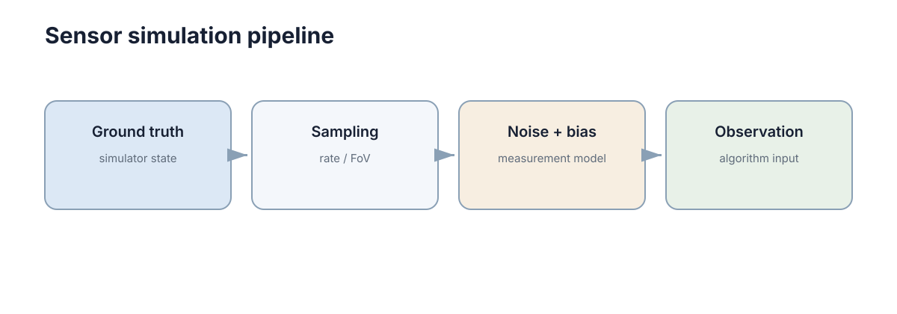

# Robot & Sensor Simulation

机器人仿真不仅要让刚体会运动，还要让软件看到与实机相似的传感器接口。只有这样，定位、规划和控制代码才能在仿真与实机之间尽量少改动。

<figure markdown="span">
  
  <figcaption>传感器接口越接近实机，后续 Sim2Real 的软件改动越少。</figcaption>
</figure>

判断仿真质量的标准不是画面是否逼真，而是**下游代码在仿真与实机之间需要改多少行**。这个标准把“传感器仿真”从渲染问题变成了接口问题：接口对了，仿真即便画质粗糙也可以用来验证算法；接口错了，再漂亮的渲染也只能验证一个不存在的机器人。

## 机器人本体模型至少要包含可运动结构

移动机器人需要底盘尺寸、轮子位置、关节约束和执行器接口；机械臂需要连杆、关节和限位。碰撞几何可以比视觉模型更简单，只要能正确近似实际碰撞范围。仿真模型的目标是支撑算法，不是做 CAD 展示。

先把变量定义清楚：$r$ 为轮半径、$b$ 为轮距、$\omega_L,\omega_R$ 为左右轮角速度、$\theta$ 为航向角、$(x,y)$ 为底盘中心位置。差速底盘的运动学为

$$\dot{x} = \frac{r}{2}(\omega_R + \omega_L)\cos\theta,\qquad \dot{y} = \frac{r}{2}(\omega_R + \omega_L)\sin\theta,\qquad \dot{\theta} = \frac{r}{b}(\omega_R - \omega_L)$$

这三个式子说明了本体模型的最低要求：$r$ 与 $b$ 必须存在，单位必须一致，且轮速接口要与实机同量纲。若 $r$ 有 $1\%$ 的标定误差，直行 $100$ m 会产生约 $1$ m 的里程计偏差，这个偏差与作用距离成正比，无法靠滤波消除。

轮距误差的影响集中在转向：若 $b$ 低估 $3\%$，原地旋转 $5$ 圈（$10\pi$ rad）后航向偏差约 $\Delta\theta \approx 0.03 \times 10\pi \approx 0.94$ rad，即约 $54^\circ$。这类误差在短距离任务中不可见，在长距离或多次掉头任务中会直接导致建图错位。

| 仿真用途 | 需要的模型精度 | 不需要的部分 |
|---|---|---|
| 运动学验证 | 轮距、轮径、关节限位 | 外壳细节、材质 |
| 动力学验证 | 质量分布、惯量、摩擦 | 线束、装饰件 |
| 碰撞检测 | 凸包近似几何 | 曲面细分 |
| 视觉渲染 | 外观与纹理 | 精确惯量 |

把用途与精度对齐，可以避免在无关维度上浪费建模时间，也避免用简化模型得出关于动力学的错误结论。下表是本体模型的最小参数清单：

| 参数 | 符号 | 典型量级 | 缺失后的后果 |
|---|---|---|---|
| 轮半径 | $r$ | 0.05–0.15 m | 里程计尺度偏差 |
| 轮距 / 轴距 | $b$ | 0.2–0.6 m | 转向角速度偏差 |
| 关节限位 | $q_{\min}, q_{\max}$ | 依机构而定 | 规划出不可达位姿 |
| 质量与惯量 | $m, I$ | 5–100 kg | 加速度响应错误 |
| 摩擦下界 | $\mu$ | 0.4–0.9 | 制动距离被低估 |
| 执行器接口 | 命令 / 反馈 | 频率与量纲 | 控制器无法复用 |

## 理想传感器只能用于最早期验证

理想 LiDAR 每个测距都精确、IMU 没有偏置、相机没有曝光问题，这种环境适合先验证算法逻辑，但不能代表实机难度。真实传感器至少存在随机噪声、固定偏置、量化、采样频率和延迟。

以 LiDAR 为例：设角分辨率为 $\Delta\phi$、距离为 $d$、单束测距噪声标准差为 $\sigma$。相邻两束激光打在平面上的弧长间隔约为 $s \approx d\,\Delta\phi$，由噪声导致的平面法向不确定度近似为

$$\eta \approx \arctan\!\left(\frac{\sigma}{s}\right)$$

取 $d = 5$ m、$\Delta\phi = 0.5^\circ$，则 $s \approx 0.044$ m；若 $\sigma = 0.02$ m，则 $\eta \approx \arctan(0.45) \approx 24^\circ$。也就是说，**理想模型下“平面拟合精度极高”的结论，在实机噪声下会退化成二十几度的法向误差**，而后者会直接影响可通行区域判断。

| 传感器 | 理想模型假设 | 实机实际 | 理想模型会掩盖的问题 |
|---|---|---|---|
| 相机 | 无噪声、无畸变 | 噪声、畸变、曝光、滚动快门 | 特征匹配稳定性 |
| LiDAR | 单束测距精确 | 约 2 cm 噪声、反射率依赖 | 平面与法向估计误差 |
| IMU | 无零偏、无尺度误差 | 零偏、尺度因子、温漂 | 二次积分漂移 |
| GNSS | 直接给出真值 | 多径、跳变、坐标系偏移 | 数值越界与跳变处理 |
| 编码器 | 计数精确 | 量化、丢脉冲 | 低速段的估计噪声 |

理想环境仍然有价值：它把“算法逻辑错”和“参数与噪声问题”分开。正确的顺序是先在理想环境确认逻辑，再逐层加入真实误差；反过来做，噪声会掩盖逻辑错误，让人误以为算法框架本身有问题。

理想传感器还有一个隐性代价：它让参数估计问题消失。当数据无噪声时，任何最小二乘问题的解都是精确的，标定与外参估计都“一次成功”；实机上场后，同样的代码会因条件数变差而给出漂移的解。仿真应主动制造条件数更差的几何布置——近共面点、短基线、重复结构——用来检查估计器的数值稳定性。

另一个容易忽略的差别是“缺数据”：理想环境里每个传感器永远有数据，而实机上遮挡、无纹理、强反光都会让某些帧缺少有效观测。若仿真从不让观测缺失，融合模块就不会实现缺失分支，实机第一次出现空洞时往往会用错误的历史值填坑。

因此传感器仿真有一条经验顺序：先验证逻辑，再验证数值稳定性，再验证缺失与异常，最后才比较性能上限。跳过中间两步直接做性能对比，得到的结论通常无法迁移到实机。

## 噪声、偏置和延迟是三种不同误差

白噪声每次随机变化；bias 会长期把测量推向一个方向；latency 则让数据到达时已经过时。三者对算法的影响不同，用测量模型可以写清区别，其中 $z_k$ 为第 $k$ 次测量、$x_k$ 为真值、$b_k$ 为偏置、$n_k$ 为零均值白噪声、$w_k$ 为偏置的随机游走增量、$\tau$ 为延迟：

$$z_k = x_{k} + b_k + n_k,\qquad b_{k+1} = b_k + w_k,\qquad z(t) = x(t-\tau) + n(t)$$

```python
import numpy as np

def simulate_imu(true_acc, stamp, bias=0.03, sigma=0.02):
    noise = np.random.normal(0.0, sigma, size=3)
    return {"stamp": stamp,
            "frame_id": "imu_link",
            "linear_acceleration": np.asarray(true_acc) + bias + noise}
```

三者对下游的影响量级完全不同。以加速度计为例取 $b = 0.03$ m/s$^2$、$\sigma = 0.02$ m/s$^2$、采样率 $f_s = 100$ Hz：白噪声在 $1$ s 平均后的残余约为 $\sigma/\sqrt{f_s} \approx 0.002$ m/s$^2$，而偏置不会随平均消失；对加速度偏置做一次积分得到速度偏差 $b\,t$，二次积分得到位置偏差 $\frac{1}{2} b t^2$。当 $t = 10$ s 时位置偏差约 $1.5$ m。

| 误差 | 统计特性 | 滤波能否消除 | 补偿方式 | 典型量级 |
|---|---|---|---|---|
| 白噪声 $n_k$ | 零均值、无记忆 | 能（降方差） | 低通 / 卡尔曼 | $\sigma = 0.02$ m/s$^2$ |
| 偏置 $b_k$ | 慢变随机游走 | 需显式建模 | 标定 + 偏置状态 | $0.01$–$0.05$ m/s$^2$ |
| 延迟 $\tau$ | 确定性但未知 | 不能 | 时间戳 + 外推 | $20$–$100$ ms |
| 量化 | 均匀分布 | 部分 | 提高分辨率 | $1$–$10$ 倍最小刻度 |
| 缩放误差 | 乘性 | 不能 | 尺度标定 | $0.5\%$–$2\%$ |

滤波可以减弱随机噪声，却不会自动修正未知固定 bias；延迟则会直接影响融合与控制的相位。让仿真接口同时输出测量值、时间戳和坐标系，下游模块才可能真正依赖正确的语义，而不是依赖“数据永远准时且对齐”这一隐含假设。

## 传感器模型的误差分层

把误差按“叠加顺序”分层，可以让仿真逐步增加难度，也让失败时容易定位是哪一层的问题。记第 $i$ 层的噪声方差为 $\sigma_i^2$、确定性偏差为 $b_i$，则多源合成的总体误差满足

$$\sigma_{\mathrm{tot}}^2 = \sum_i \sigma_i^2,\qquad |b_{\mathrm{tot}}| \le \sum_i |b_i|$$

第一条说明随机误差按方差相加，第二条说明确定性偏差按绝对值相加：**偏置的叠加速度远快于噪声**，这也是“只加高斯噪声”的仿真会系统性低估实机难度的原因。

| 层级 | 加入什么 | 验证目标 | 典型实验 |
|---|---|---|---|
| 理想 | 真值直接输出 | 算法逻辑是否正确 | 单元测试、算法对比 |
| 噪声层 | 高斯 / 泊松噪声 | 滤波是否有效 | 静态数据估计 $R$ |
| 偏置层 | 固定与慢变偏差 | 标定与偏差估计 | 长时间静止与匀速段 |
| 延迟层 | 采样与传输延迟 | 时间同步与相位 | 阶跃响应对比 |
| 失效层 | 遮挡、饱和、丢帧、冻结 | 异常处理与降级 | 故障注入演练 |

实践中最常见的错误是**只做噪声层**：加高斯噪声后滤波效果看起来很好，但实机上因为偏置未标定、延迟未补偿而失效。三层以上必须一起做，否则仿真提供的信心是虚高的。

分层的另一好处是可以做误差归因实验：固定其他层，只放大某一层，观察任务指标的变化率 $\partial J / \partial \sigma_i$。若某层的敏感度远高于其他层，仿真投入就应该优先花在那里，而不是平均分配。

分层还决定了参数标定的顺序：先标定确定性偏差（偏置、尺度、外参），再估计随机噪声，最后处理时序（延迟与时钟）。顺序颠倒会互相污染——用未标定的数据估计噪声方差，会把偏置误算成噪声，得到偏大的噪声矩阵，进而让滤波器过度信任模型。

各层的典型影响量级可以汇总成一个粗略预算：噪声层贡献约 1–3 cm 的位置不确定性，偏置层在 10 s 内可贡献 0.5–2 m，延迟层在 2 m/s 下贡献 4–20 cm，失效层则可能直接造成米级跳变。因此长时任务的主要威胁是偏置与失效，而不是噪声。

最后，分层实验必须记录“哪一层被打开”这一元信息。若一份日志是在噪声层和失效层同时打开的情况下采集的，事后就无法判断某个跳变究竟来自哪一层，归因实验也就失效了。

## 相机 / LiDAR / IMU / GNSS 的仿真实现

不同传感器的仿真原理和可信度差别很大。LiDAR 的核心运算是射线与几何求交：设射线起点 $\mathbf{o}$、方向 $\mathbf{d}$、平面上的点 $\mathbf{p}_i$ 与法向 $\mathbf{n}_i$，则命中参数为

$$t_i = \frac{(\mathbf{o} - \mathbf{p}_i) \cdot \mathbf{n}_i}{\mathbf{d} \cdot \mathbf{n}_i},\qquad d = \min_{\mathbf{d} \cdot \mathbf{n}_i \neq 0,\; t_i > 0} t_i$$

这个式子说明 LiDAR 仿真天然是几何问题而非外观问题：几何一致时，测距分布就接近真实；而反射率、光束发散、运动畸变仍需额外建模。

| 传感器 | 仿真方式 | 主要成本 | 可信度 | 常见偏差来源 |
|---|---|---|---|---|
| 相机 | 渲染管线（光栅化 / 光线追踪） | 高（GPU） | 中–高 | 材质、光照、曝光、镜头畸变 |
| LiDAR | 几何 ray casting | 中 | 高 | 反射率模型、光束发散、运动畸变 |
| IMU | 对真值求导 + 噪声模型 | 低 | 中 | 零偏、尺度因子、温漂 |
| GNSS | 位置加噪声与多径模型 | 低 | 低–中 | 多径、遮挡、电离层、坐标系偏移 |
| 深度相机 | 渲染 + 视差量化 | 中–高 | 中 | 红外散斑、无纹理区缺失 |

相机是“看起来最真实但最难保证物理一致”的一类：渲染出的图像在使用学习模型时经常出现**仿真特征与实机特征分布不同**的问题，这正是域随机化要处理的。相比之下 LiDAR 的几何仿真物理性更强，迁移通常更顺利。

计算成本也要纳入分层取舍：一台 128 线 LiDAR 在 10 Hz 下每秒产生约 $1.3 \times 10^6$ 个测距，而相机 30 Hz 的渲染成本主要落在像素数上。若训练循环需要上万次并行采样，就要在传感器数量、更新率与精度之间做明确取舍，而不是全部拉满。

IMU 的仿真虽然只是“对真值求导”，但不能把数值差分当作默认实现：有限差分会产生量化台阶，尤其在低速或静止段。更稳妥的做法是让物理引擎直接输出加速度项，再叠加噪声模型，避免求导过程放大量化误差。

GNSS 的可信度最低但影响最大：一次多径可能造成 5–30 m 的瞬时跳变。若仿真里只加高斯噪声，定位模块的鲁棒性设计（跳变检测、外点剔除）永远不会被触发。按概率注入跳变，是成本最低、收益最明显的仿真改进之一。

相机与 LiDAR 的取舍可以概括为：相机带来语义但缺乏几何精度，LiDAR 带来几何但缺乏语义。仿真若只实现其中一种，下游的融合逻辑就只在单模态假设下被验证过，而实机往往两种模态同时存在且互相纠错。

## 坐标系和时间戳应尽量复现实机语义

如果实机 `/scan` 使用 `laser_frame`，仿真也应保持同样的 frame 逻辑；如果实机 IMU 以 100 Hz 发布，仿真不应无意中以每个物理 step 无限频率输出。坐标变换与时间对齐的形式化写法是

$$\mathbf{p}_W = T_{WB}\, T_{BI}\, \mathbf{p}_{I},\qquad \tilde{z}(t) = z(t - \tau)$$

其中 $T_{WB}$ 是机体系到世界系的变换、$T_{BI}$ 是传感器系到机体系的变换、$\tau$ 是延迟。时间偏置 $\tau$ 造成的运动误差近似为 $e \approx v\,\tau$：以 $v = 1$ m/s、$\tau = 50$ ms 计算，误差约 $5$ cm；若速度升到 $2$ m/s 且延迟达到 $100$ ms，误差直接变为 $20$ cm，已经超过许多定位精度要求。

接口一致性比“仿真画面是否逼真”更直接影响代码迁移成本：

| 语义项 | 实机行为 | 仿真必须复现的理由 |
|---|---|---|
| frame 命名与树结构 | 由 URDF 与 TF 决定 | 坐标变换代码的路径依赖 |
| 发布频率 | 由驱动决定（如 10 / 100 Hz） | 下游滤波与缓冲深度假设 |
| 时间戳来源 | 采集时刻，含传输延迟 | 时间对齐与外推逻辑 |
| 数据有效性 | 可能为空、NaN、超时 | 异常处理路径必须被走到 |
| 单位与量纲 | 由消息定义固定 | 数值越界与缩放错误 |

其中**时间戳语义**最容易被忽略：如果仿真里时间戳严格等于状态计算时刻，那么所有基于时间对齐的代码都不会暴露问题；而实机上一个 50 ms 的固定偏移就足以让多传感器融合产生持续偏差。给仿真注入一个与实机同量级的时间偏置，是低成本高收益的做法。

还有一个隐蔽的问题是“时间基准”：仿真时钟理想推进，而实机时钟存在漂移与网络对时抖动。若仿真使用严格的逻辑时间，任何依赖时钟单调性的代码都不会出问题；实机上时钟回退一次，就可能让缓冲队列永久错位。

检查方式很直接：让仿真输出与实机相同格式的数据包（含 header、frame_id、时间戳），并让同一套下游代码在两种数据源上运行，比较输出差异。差异超出预期时，先查语义，而不是先查算法。

量化关系也可以用来设定验收阈值：若允许的位置误差预算是 10 cm，平台最大速度为 2 m/s，则时间对齐误差必须控制在 50 ms 以内，因为 $e \approx v\tau$ 已经把速度、延迟与误差预算绑定在一起。

## 故障仿真比单纯加噪声更有价值

真实系统会出现短时丢帧、遮挡、饱和和传感器离线。若安全和容错模块只在完美数据下测试，就无法验证异常路径。故障注入的强度应当分级，并按“一段时间内的连续缺失”为单位定义，而不是按单次事件定义：

| 注入项 | 轻 | 中 | 重 | 期望触发的行为 |
|---|---|---|---|---|
| LiDAR 丢帧 | 1% | 5% | 20% | 短暂降级 / 重定位 |
| 相机全黑 | 2 帧 | 0.5 s | 3 s | 切换到雷达或停车 |
| IMU 冻结 | 0.2 s | 1 s | 10 s | 交叉校验发现 |
| 时间戳跳变 | $+10$ ms | $\pm 100$ ms | 回退 1 s | 缓冲排序与丢包 |
| 数据越界 | 单值 NaN | 连续 NaN | 整帧 NaN | 有效性检查与隔离 |

时间尺度决定了故障能否被检测到：一台 10 Hz 的 LiDAR 连续丢 3 帧，相当于 $300$ ms 没有新数据，已经超过常见的 200 ms 超时阈值，会触发降级；而同样“丢了 3 帧”在 100 Hz 的 IMU 上只相当于 $30$ ms，通常被缓冲吸收。**同一个“丢帧率”，在不同更新率的传感器上意味着完全不同的可用性**。

可以逐步增加难度：先理想传感器验证功能，再加入统计噪声，最后加入延迟、丢包和特定故障。每一级都应记录任务指标的变化，用来判断容错模块是否真的在工作。

故障注入的排程也应仿真实机统计学：随机丢帧模拟链路抖动，突发连续丢帧模拟遮挡或重启，周期性弱信号模拟干扰。三种形态触发的下游行为不同，缺一种就会漏掉一类缺陷。

还要注入“部分错误”而不是只有“完全错误”：传感器可能仍在输出数据，但数值已经偏离——尺度变了 5%、偏置缓慢漂移、外参被轻微碰动。这类故障不会触发超时，只能靠一致性检查或与其它传感器比对发现，是最危险的形态。

量化关系：若控制周期为 20 ms，而检测算法需要 5 帧新数据才能确认异常，那么在 10 Hz 的传感器上检测延迟约 500 ms，在 100 Hz 的传感器上约 50 ms。同样的算法在不同的更新率下会得到数量级不同的安全性，这也解释了为什么提高采样率有时比改进算法更有效。

因此故障仿真的输出不应只是“是否崩溃”，而应包括四个时间戳：检测时刻、隔离时刻、降级时刻、恢复时刻。它们可以直接与安全余量预算对照，判断容错链路是否足够快。

一个常见的误区是把故障注入当成一次性测试。真实系统的故障组合会随环境与时间变化，因此注入脚本应作为回归测试的一部分随代码一起运行，而不是在项目末尾补做一次。

## 传感器模型应包含失效状态

只给测量值叠加高斯噪声无法覆盖遮挡、饱和、丢帧和时间跳变。接口中应允许显式表达数据无效、质量下降或长时间无更新，使下游模块能够练习真实的异常处理路径。

| 失效模式 | 仿真中如何表达 | 需要验证的下游行为 |
|---|---|---|
| 遮挡 | 该方向无回波 / 图像全黑块 | 是否误把空区当地图 |
| 饱和 | 数值钳位到上下限 | 是否触发范围检查 |
| 丢帧 | 跳过若干帧且不更新时间戳 | 是否按超时降级 |
| 冻结 | 持续输出同一帧 | 能否通过交叉校验发现 |
| 时间跳变 | 时间戳倒退或跳跃 | 缓冲与排序逻辑是否健壮 |
| 漂移 | 偏置缓慢线性增长 | 是否有在线偏差估计 |
| 通道错位 | 交换两个轴或两个话题 | 是否能发现语义错误 |

“冻结”和“丢帧”的区别值得强调：丢帧会触发超时，容易被发现；冻结不会触发任何超时，只能靠数据冗余或与其它传感器的一致性检查发现。**仿真必须能制造这两种不同形态的故障**，否则容错逻辑的测试覆盖率是虚假的。一个实用的判据是：任何一条失效注入路径，都应该能在日志中找到对应的检测事件与恢复事件各一条。

接口设计的建议是：把“有效性”作为一级字段，而不是用空数组或 NaN 隐式表达。显式的状态字段（有效 / 降级 / 无效 + 原因码）可以被日志与监控系统直接统计，而隐式表达只能靠代码去猜，猜错时往往不会报错，只会让下游使用脏数据。

有效性状态与时间戳还应满足一致性约束：若某帧被标记为无效，其时间戳仍应更新，否则下游无法区分“传感器没说话”和“传感器说的话没通过检查”这两种完全不同的处境。

量化上，可以给每类失效定义可接受的最大持续时间：单次丢帧不超过 100 ms、冻结不超过 500 ms、跳变恢复不超过 1 s。超过这些界限就必须进入降级，而不是继续依赖该传感器。

最后，失效注入要与安全逻辑成对设计：每种失效都应有一个明确的“责任人”——是融合模块、监控模块还是运行时保护层。没有责任人的失效，最终会由物理世界来兜底。

验收时可以统计“失效覆盖率”：被注入过的失效模式数除以接口声明支持的失效模式数。这个比率应当为 1，而不是“重要的都覆盖了”——因为未被覆盖的那些模式由定义上就是没人评估过的。

## 传感器仿真的验收基线

传感器仿真是否合格，可以用一组可检查的条件来判定，而不是靠主观评价“像不像”。下表给出一个可直接落进项目模板的基线：

| 检查项 | 判据（示例） | 证据形式 |
|---|---|---|
| 单位与量纲 | 与实机消息定义逐字段一致 | 字段对照表 |
| 更新率 | 与实机误差 $\le 10\%$ | 频率统计直方图 |
| 噪声方差 | 与静止段实测同量级 | 方差估计报告 |
| 偏置与漂移 | 存在且有标定路径 | 标定记录 |
| 延迟与时间偏置 | 与实机同量级（$20$–$100$ ms） | 阶跃响应对比 |
| 坐标系语义 | frame 名与树结构与实机一致 | TF 树导出对比 |
| 失效注入 | 六类失效可开关且可记录 | 注入脚本与日志 |
| 数据有效性 | 空值 / NaN / 超时路径被触发过 | 覆盖率报告 |

验收基线的作用是把“仿真够不够好”这个抽象问题，转化为一张可以打勾的表。只要有一行长期为空，对应的下游模块就处于未验证状态；而迁移成本通常正是从这些未验证的行里冒出来的。

基线的使用方式是把它当成上线门禁的一部分：任何会改变传感器接口或仿真配置的提交，都必须重新跑一遍基线中可自动检查的项，并逐项记录通过状态。

三条最容易长期为空的检查是数据有效性、时间偏置与失效注入。它们都不影响正常路径的运行，因此很容易被“以后再说”，而迁移阶段最耗时的排查往往正好落在它们身上。

如果只能保留三项检查，建议保留：更新率与实机一致、时间戳包含真实延迟、失效注入可开关。前两项决定仿真数据是否可用，第三项决定异常路径是否被验证过。

最后一条经验是：基线的判据要用数字写，不要用“接近实机”。把“噪声与实机同量级”改写成“方差差异 $\le 2$ 倍”，才能让不同的人得出同样的结论，也才能让 CI 自动判定。

> **下一步**：本章让仿真可信，[Reality Gap & Domain Randomization](./03-reality-gap-randomization.md) 处理仿真与实机之间的系统性差异，[Sim2Real & Real2Sim](./04-sim2real-real2sim.md) 给出闭环校准流程。传感器噪声标定见 [Sensing & State Estimation](../robotics/02-sensing-estimation.md)，多传感器时间对齐见 [Multi-Modal Perception](../perception/05-multimodal.md)。
