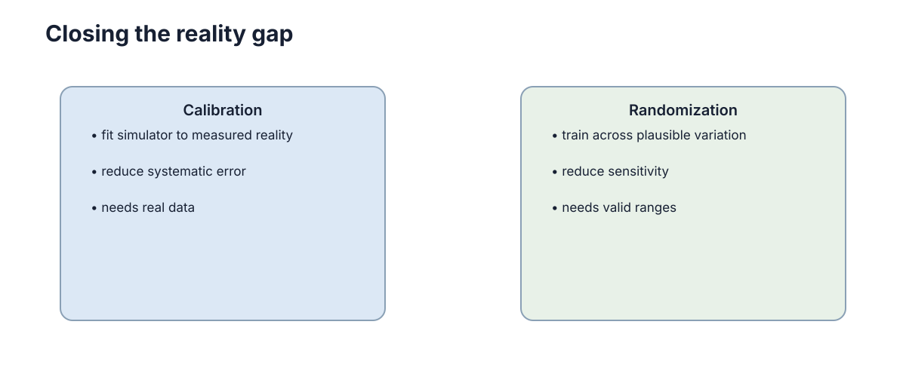

# Reality Gap 与域随机化

仿真中的策略到了实机性能下降，通常不是因为“仿真没有价值”，而是因为训练过程中依赖了某些在真实世界并不稳定的细节。Reality Gap 就是**仿真分布与真实分布之间会影响任务行为的差异**。

<figure markdown="span">
  
  <figcaption>随机化应覆盖真实系统可能出现的合理变化，而不是无边界增加难度。</figcaption>
</figure>

## Reality Gap 的三类来源

常见差异包括：质量和摩擦参数不准、执行器响应和延迟不一致、相机光照/纹理不同、IMU 偏置、轮胎打滑以及控制频率变化。

先把这些差异分类，比笼统地说“仿真不真实”更容易定位问题。

## 最危险的是策略学会利用仿真器的偶然细节

如果摩擦系数永远固定为某个精确值，策略可能形成对这个值高度敏感的动作；如果所有纹理和光照完全一致，视觉模型可能记住仿真外观而非任务结构。

这类“仿真捷径”在训练指标上看不出来，部署时才暴露。

## 域随机化让训练覆盖一组可能的世界

训练时随机变化质量、摩擦、延迟、噪声、光照等，使策略必须在多个环境实例中都工作。目标不是让环境无限困难，而是让策略对**真实系统会发生的变化**不敏感。

随机化范围最好来自实机测量、厂家参数或合理工程范围。

## 范围太窄和太宽都会出问题

太窄无法覆盖真实参数；太宽则会让学习问题不必要地困难，甚至逼迫策略变得过度保守。最有效的方法通常是先做简单实机实验，找出哪些参数真正影响闭环行为，再重点随机化。

## 域随机化与系统校准

如果模拟器中的轮距写错一倍，不应该指望“随机化足够大”来掩盖。能测量的固定参数应先校准，剩余不可避免的不确定性再通过随机化处理。

## 先用小实验测出最敏感的参数

可以分别改变摩擦、延迟、质量或噪声，观察任务指标变化。如果摩擦变化对策略几乎没有影响，就没必要给它很宽的随机范围；如果 50 ms 延迟就让控制明显恶化，延迟模型就应该重点校准。

这种 sensitivity analysis 能让域随机化更有针对性。

## 随机化范围来自测量而非猜测

域随机化的上下界应由硬件公差、标定记录或小规模实测给出。范围过窄无法覆盖现实，过宽则迫使策略为不可能出现的世界付出性能。先做敏感性分析，再把训练资源集中到真正影响任务的参数。
