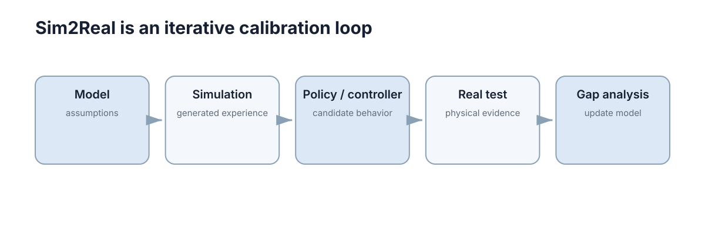

# Sim2Real 与 Real2Sim

Sim2Real 不是一次性的“把仿真模型导出到真实机器人”，而是一条反复迭代的闭环：**仿真训练 → 实机验证 → 发现偏差 → 用真实数据校准仿真 → 再训练。** Real2Sim 就发生在这个回流阶段。

<figure markdown="span">
  
  <figcaption>真实系统提供误差信号，仿真再根据这些误差更新参数和训练分布。</figcaption>
</figure>

## 一、迁移前先列出误差预算

可以把可能影响结果的差异列成表：轮径误差多少、控制延迟多少、相机曝光差异多大、摩擦范围是多少、传感器噪声是否一致。

这样实机失败时就能判断主要原因，而不是把所有问题都归结为“Reality Gap”。

## 二、Sim2Real 最安全的方式是逐级扩大真实测试范围

先在低速度、宽安全区验证基本动作，再扩大速度和场景复杂度。直接从仿真跳到高风险实机条件，很难区分算法错误、接口错误和模型偏差。

逐级测试同时能为后续 Real2Sim 收集更干净的数据。

## 三、Real2Sim 用真实数据反过来修正模拟器

可以根据真实轨迹估计摩擦和执行器延迟，根据传感器日志估计噪声、bias 和丢包模式，根据相机数据更新纹理与光照范围。

Real2Sim 不要求把每个物理参数都精确辨识出来，只需要让仿真在**任务相关观测和行为**上更接近实机。

## 四、迁移时要尽量保持软件接口一致

仿真和实机若都输出相同 ROS Topic、坐标系和控制接口，切换平台时主要变化只是驱动和数据源。若算法在仿真中依赖“直接读取真值状态”，实机没有对应输入，迁移会从一开始就失败。

## 五、最终标准不是“仿真表现好”，而是“现实闭环稳定”

仿真只是低成本试验场。模型、随机化和训练技巧是否有效，最终仍需要真实系统上的成功率、跟踪误差、碰撞率、稳定时间等指标验证。

## 六、迁移成功要用同一组任务指标比较

仿真和实机应尽量使用一致指标，例如轨迹误差、碰撞率、完成时间、能耗和控制平滑度。只有这样才能判断差距来自哪里。

“实机能跑起来”只是最低标准；真正需要观察的是性能下降幅度是否在可接受范围，以及误差是否随着环境变化保持稳定。

