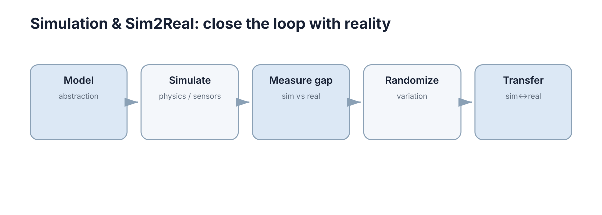

# Simulation & Sim2Real

仿真部分关注如何建立可计算模型、模拟机器人和传感器，并理解仿真与真实世界之间的 Reality Gap 以及迁移方法。

<figure markdown="span">
  
  <figcaption>Simulation Sim2Real 的核心概念关系。</figcaption>
</figure>

## 内容

1. [建模与物理仿真](01-modeling-physics.md)
2. [机器人与传感器仿真](02-robot-sensor-simulation.md)
3. [Reality Gap 与域随机化](03-reality-gap-randomization.md)
4. [Sim2Real 与 Real2Sim](04-sim2real-real2sim.md)
