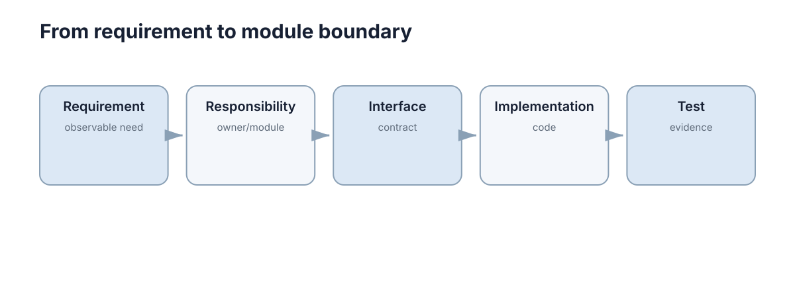

# Requirements & Architecture

软件工程的第一步不是选框架，而是先回答两个问题：**系统必须完成什么，以及哪些质量不能牺牲**。架构的作用，就是把这些要求变成可以实现、测试和长期维护的结构。



## 先把功能与质量分开

功能需求描述系统**做什么**，例如“用户可以提交任务”“机器人可以上报状态”。非功能需求描述系统**做到什么程度**，例如延迟、吞吐、可靠性、安全性和可维护性。

同一个功能可以对应完全不同的架构。例如一个只给实验室内部使用的任务面板，和一个要支持上万设备同时连接的平台，都能完成“提交任务”，但它们对并发、容错和部署的要求完全不同。

写需求时至少要明确三类信息：

- **输入与输出**：系统接收什么，产生什么；
- **边界与约束**：哪些事情由本系统负责，哪些交给外部系统；
- **可验收条件**：什么现象出现时，才能说需求已经完成。

模糊的“系统要稳定、要快”无法指导设计。更好的写法是“核心接口 95% 请求在 200 ms 内返回”“单个工作节点故障后任务不会丢失”。

## 架构是对系统边界和依赖关系的安排

一个够用的心智模型是把系统拆成三层：

```text
Interface / API
      ↓
Application / Service
      ↓
Domain + Infrastructure
```

- **接口层**负责接收请求和返回结果；
- **业务层**组织一个完整用例，例如“创建任务并分配机器人”；
- **基础设施层**负责数据库、消息系统、文件、硬件或第三方服务。

关键不是层数，而是**依赖方向清楚**。业务规则不应该散落在 HTTP 路由、数据库 SQL 和 UI 回调里，否则任何一处变化都会牵动整个系统。

下面这个例子把“业务规则”和“存储细节”分开：

```python
class TaskService:
    def __init__(self, repo):
        self.repo = repo

    def create(self, title):
        task = {"title": title, "status": "pending"}
        return self.repo.save(task)
```

这里 `TaskService` 只知道“需要一个 repo”，并不关心数据最终写入 SQLite、PostgreSQL 还是内存。这个边界就是模块化的价值。

## 什么时候需要拆模块，什么时候不要

模块应该围绕**稳定的职责**划分，而不是按文件类型机械拆分。

一个模块值得独立出来，通常满足至少一个条件：

1. 它有清晰输入输出；
2. 它的变化原因与其他部分不同；
3. 它可以被独立测试；
4. 它可能被不同实现替换。

反过来，如果两个模块永远一起修改、彼此大量读取内部状态，那么“拆开”只是在增加接口数量。

初学者最容易犯的错误是过早微服务化。**单体并不等于混乱**。对于课程项目和大多数科研原型，一个边界清楚的模块化单体通常比一开始拆成十几个服务更容易开发和调试。只有当独立部署、独立扩缩容或团队边界真的成为需求时，服务拆分才有明确收益。

## 用一个机器人任务系统走一遍

假设系统要支持：用户提交目标点，规划模块生成路径，机器人执行并持续上报状态。

可以先划分四个职责：

```text
Task API ──→ Task Service ──→ Planner
                    │
                    └──────→ Robot Adapter
```

`Task API` 不直接控制机器人；`Planner` 不负责保存用户信息；`Robot Adapter` 只处理 ROS2/设备通信。这样当规划算法从 A* 换成 MPC，或者机器人通信方式发生变化时，其他部分不需要跟着重写。

这就是架构设计最实用的判断标准：**变化能不能被限制在合理范围内**。

## 架构图最终要回答什么

一张有用的架构图至少应该让读者看懂：

- 系统有哪些主要组件；
- 数据或控制命令怎样流动；
- 哪些接口跨进程、跨机器或跨网络；
- 哪些组件依赖外部资源；
- 故障发生时影响会传播到哪里。

如果架构图只有很多方框，却看不出数据流和依赖方向，它的价值就很有限。对于学习和小型工程，**先把边界、接口和故障传播讲清楚，比掌握几十种架构模式更重要**。

## 用可验证条件约束架构

“系统要稳定”不能直接指导设计；“定位失效后 200 ms 内停止速度输出”才是可验证条件。把需求写成触发条件、可观察行为和时间边界，架构才能据此划分监控、控制与故障处理责任。
