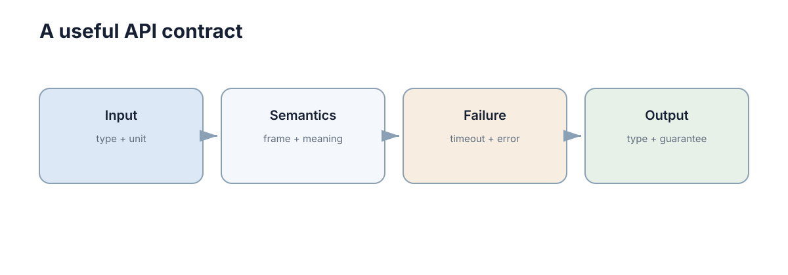

# Modular Design & APIs

架构确定了“大块怎么分”，API 决定这些模块**怎样合作而不互相侵入内部实现**。好的接口不是函数越多越好，而是让调用者只依赖必要信息。



## 先把模块边界写成契约

接口可以理解成一份契约：调用者提供什么，服务承诺返回什么，失败时怎样表达。

例如创建任务：

```text
POST /tasks
input : {target_x, target_y}
output: {task_id, status}
errors: 400 / 409 / 503
```

这比“调用 `create_task()`”更完整，因为它同时说明了数据结构和失败语义。

代码内部也应保持同样原则：

```python
def plan(start, goal) -> list[tuple[float, float]]:
    """Return a path from start to goal, or raise NoPathError."""
```

调用者不应该依赖规划器内部用了 A*、Dijkstra 还是其他算法。

## 一个 HTTP 请求怎样进入业务逻辑

常见的后端流程可以压缩成：

```text
Request → Validation → Service → Repository/External System → Response
```

路由层只负责协议相关工作；业务判断放在 Service；数据访问放在 Repository 或 Adapter。这样测试业务规则时不需要真的启动 HTTP 服务器。

```python
def create_task(payload, service):
    if "goal" not in payload:
        return {"error": "goal required"}, 400
    task = service.create(payload["goal"])
    return task, 201
```

重点不是某个 Web 框架，而是**协议层不要吞掉业务层**。

## REST 只需要先掌握资源和状态码

REST 的入门重点只有三个：

1. URL 表示资源，例如 `/tasks/42`；
2. HTTP 方法表达常见操作，例如 GET/POST/PATCH/DELETE；
3. 状态码清楚表达结果，例如 200、201、400、404、409、500。

不要把动作全塞进 URL：

```text
不推荐: POST /doCreateTask
更清楚: POST /tasks
```

也不要为了“RESTful”强行把所有系统设计成 HTTP。进程内函数调用、ROS2 topic/service/action、消息队列和 RPC 都是接口形式，选择取决于通信语义。

## 错误也是接口的一部分

最难维护的接口往往不是成功返回，而是每次失败都长得不一样。

建议统一错误结构：

```json
{
  "code": "TASK_CONFLICT",
  "message": "robot already has an active task"
}
```

程序依赖稳定的 `code`，人阅读 `message`。同时要区分：

- **输入错误**：调用者可以修改请求；
- **业务冲突**：请求本身合法，但当前状态不允许；
- **系统故障**：数据库、网络或外部服务异常。

这种区分直接影响重试策略和故障定位。

## 接口变化时怎样避免改一个地方全崩

接口一旦被多个模块使用，就要尽量保持向后兼容。常用方法是新增字段而不是随意改字段含义、给必要变化增加版本、在边界处做适配。

工程上还要注意**幂等性**：同一个请求因为网络超时被重复发送时，是否会创建两个任务？对于“创建订单、提交任务、扣款”这类操作，通常需要请求 ID 或去重机制。

API 的核心并不是记住 REST、GraphQL 或 gRPC 的全部特性，而是形成一个习惯：**任何跨模块的数据，都应该有明确结构、明确语义和明确失败方式**。

## 兼容性来自语义稳定

API 字段名称不变，并不代表接口兼容。单位、默认值、错误语义或排序规则改变，同样可能破坏调用方。版本管理应记录行为契约的变化，并用契约测试验证旧调用仍得到预期结果。
