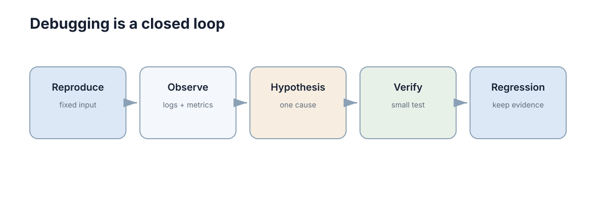

# 测试与调试

测试回答“这个行为以后还能不能保持正确”，调试回答“它现在为什么不正确”。两者结合，才能把一次修复变成长期可靠的系统。



## 测试层级与边界覆盖

最常用的三层测试：

- **单元测试**：验证一个函数或模块；
- **集成测试**：验证模块之间的接口；
- **端到端测试**：从真实入口走完整流程。

越靠下的测试运行越快、定位越容易；越靠上的测试越接近真实系统，但成本更高。因此大多数项目应让单元/集成测试承担主要数量，只保留少量关键端到端流程。

## 单元测试先覆盖正常、边界、错误三类情况

例如一个限速函数：

```python
def clamp_speed(v, limit=1.0):
    return max(-limit, min(limit, v))


def test_clamp_speed():
    assert clamp_speed(0.4) == 0.4
    assert clamp_speed(2.0) == 1.0
    assert clamp_speed(-2.0) == -1.0
```

测试的价值不是证明“代码永远正确”，而是在需求已经明确的地方建立自动检查。

## 集成测试专门抓单独都对，接起来就错

很多工程故障发生在边界：字段名不一致、单位不同、超时策略冲突、数据库事务没有提交、ROS 消息坐标系不同。

因此集成测试最应该覆盖**模块之间真正传递的数据**。例如规划模块输出的是米，控制模块却按厘米解释，这类错误单元测试很难发现。

## 调试要从现象走向最小复现

一个有效的调试闭环是：

```text
复现问题 → 缩小范围 → 提出假设 → 收集证据 → 修复 → 回归测试
```

最常见的低效方式是“哪里可疑就加一堆 print”。更好的做法是先确定：输入是否正确？错误第一次出现在哪一层？问题是否稳定复现？

```python
assert state.shape == (6,), state.shape
assert np.isfinite(state).all(), state
```

这种小断言往往比几十行日志更快定位数值和接口问题。

## 日志要帮助回答发生了什么

日志至少应包含时间、关键实体 ID、事件和必要上下文。例如：

```text
10:31:22 task=42 robot=r3 event=planning_failed reason=no_path
```

不要记录无法行动的信息，如“Error happened”。也不要把高频传感器数据全部塞进普通日志；大量原始数据更适合独立记录或指标系统。

## 修复之后一定补回归测试

如果一个 bug 能稳定复现，最理想的结束方式不是“现在运行正常”，而是先把它写成失败测试，再修到测试通过。这样同一类错误以后重新出现时，CI 可以在合并前直接拦住。

测试与调试最终形成的是一个闭环：**错误先变成可复现行为，再变成自动化约束**。

## 测试金字塔在机器人系统中的变化

纯函数与协议逻辑适合快速单元测试，节点组合适合集成测试，完整仿真用于验证时序和系统行为，实机测试则覆盖传感器与执行器差异。越靠近实机成本越高，因此应把能在低层发现的问题尽量提前。
