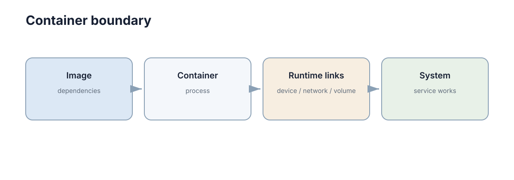
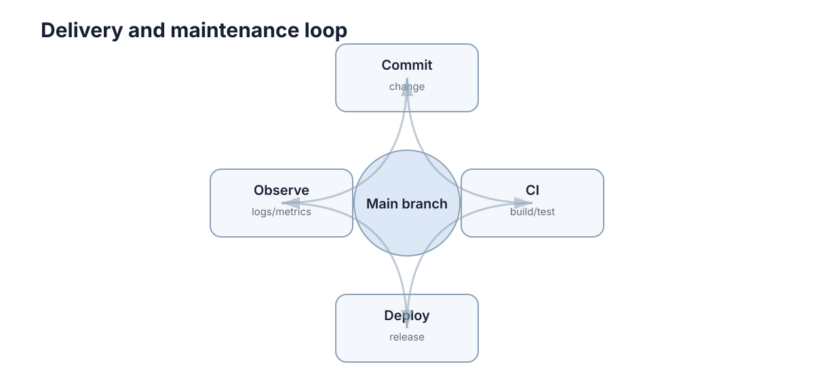

# Docker, CI & Reliability

代码在开发机上跑通，只说明“程序可以运行”；部署要解决的是：**换一台机器后还能不能按同样方式启动，出错后能不能快速发现和恢复**。可靠性不是一种可以事后追加的属性，它是从镜像、流水线、健康检查到回滚路径一整套设计决定的结果。**把系统交付出去的那一刻，它的生命周期才真正开始。**



## Docker 解决的是运行环境一致性

容器镜像把应用和依赖一起描述，使开发、测试和部署使用同一套环境。它真正消灭的是那句最常见的推脱：“在我机器上是好的。”

一个最小 Python Dockerfile：

```dockerfile
FROM python:3.12-slim
WORKDIR /app
COPY requirements.txt .
RUN pip install --no-cache-dir -r requirements.txt
COPY . .
CMD ["python", "main.py"]
```

镜像是静态模板，容器是镜像启动后的运行实例。真正需要长期保存的数据不要只写在容器内部，而应使用挂载目录、数据库或对象存储——容器被删除时，内部文件系统也随之消失。

环境一致性带来的收益通常体现在三个方面：

- **依赖版本固定**：`python:3.12-slim` 加上锁定的依赖文件，让“某个库昨天还好好的”这类问题在构建阶段暴露，而不是在演示现场暴露；
- **启动方式固定**：入口命令写在镜像里，避免部署时靠一串手写命令和口头约定；
- **可复现构建**：同一份 Dockerfile 在任何支持 Docker 的机器上产出行为一致的运行环境。

但要注意，Docker 只保证**用户态环境**一致。内核版本、GPU 驱动、设备节点、宿主机的时钟与外设状态都不在镜像范围内，因此容器化并不能消除所有“环境差异”。如果你的程序依赖 GPU 或特定硬件，构建一致只是第一步。

与另外两种常见做法对比，能更清楚看到容器的定位：虚拟环境（venv、conda）只隔离 Python 依赖，不隔离系统库和内核；虚拟机隔离得更彻底，但启动慢、占用大、镜像分发成本高。容器处在中间——共享宿主机内核，同时打包用户态依赖与文件系统，因此启动快、体积小，代价是与宿主机耦合更紧。理解这个取舍，就不会期待容器去解决驱动或实时的所有问题。

## 镜像分层与构建缓存

镜像不是一整块，而是由若干只读**层**（layer）叠加而成：每条 `COPY`、`RUN`、`ADD` 都会产生一层，层一旦生成就可被后续构建复用。构建缓存是否命中，直接决定了迭代速度。规则很简单：**只要某一层的输入没有变化，它和它之前的所有层都可以直接复用；某一层失效，它之后的所有层都必须重建。**

因此 Dockerfile 里指令的顺序比很多人想象的更重要：

| 常见写法 | 缓存是否复用 | 镜像体积 |
| --- | --- | --- |
| 先 `COPY . .` 再 `pip install` | 改一个源文件即全部依赖重装 | 大，且构建慢 |
| 先 `COPY requirements.txt` 再 `pip install`，最后 `COPY . .` | 依赖不变时代码改动只重建最后一层 | 合理，构建快 |
| 把测试、编辑器配置、数据集复制进最终镜像 | 不必要地频繁失效 | 明显偏大 |
| 多阶段构建，只在最后阶段拷贝产物 | 构建工具层不带入运行镜像 | 小，攻击面也小 |
| 用固定 tag 的基础镜像 | 可复现、缓存友好 | 稳定 |
| 用 `:latest` 基础镜像 | 上游一变全部失效 | 不确定，随时漂移 |

常见的缓存失效条件有四类：基础镜像 tag 指向了新版本；被 `COPY` 的文件内容有变化；`RUN` 命令的字符串有变化；构建时依赖的外部网络资源变化。理解这四点之后，优化手段就很直接——把变化频率最低的指令放前面，把变化频率最高的放最后，并且用 `.dockerignore` 把无关文件（`.git`、日志、大数据集）排除在构建上下文之外，避免它们无意义地触发缓存失效。

多阶段构建是控制体积的主要手段：第一阶段装编译器和构建依赖，产出可执行文件或 wheel 包；第二阶段只保留运行时最小依赖，把上一步的产物拷进来。这样最终镜像既小又快，也减少了因构建工具带来的安全问题。体积小不只是省磁盘，它还直接影响拉取时间，而拉取时间在弹性扩容和故障恢复时就是恢复时间。

除了分层，还有两个容易被忽略的缓存细节。第一，**缓存挂载**：现代构建工具支持把包管理器的下载目录挂载为缓存，这样即使依赖清单没变、层被重建，也不必重新联网下载全部依赖。第二，**架构差异**：在 x86 机器上构建的镜像拉取到 ARM 设备上无法运行，交叉构建时需要显式指定目标平台，否则缓存命中带来的“构建很快”反而会掩盖产物不可用的问题。

判断一个 Dockerfile 写好没有，最实用的检验方式是：**只改一行业务代码，看重新构建需要多久**。如果超过十几秒，通常说明依赖安装没有被正确分离到前面的层里；如果改一个测试文件导致最终镜像变大，说明构建上下文里混进了不该进镜像的文件。

## 容器边界不能替代系统边界

“把两个程序放进不同容器”并不会自动让架构变好。容器之间仍然需要清楚的端口、协议、数据格式和故障处理。

容器提供的隔离是**进程与文件系统层面**的，它不会自动解决这些问题：

- 两个容器之间的调用仍然可能超时、失败、乱序；
- 消息格式仍然可能在版本升级时不一致；
- 共享状态（数据库、消息队列、共享内存）仍然需要事务与幂等设计；
- 日志分散在多个容器里，不做聚合就等于没有日志。

也就是说，容器化是一次**部署方式的改变**，而不是一次**架构质量的提升**。如果模块之间的接口本来模糊，容器化之后只是把模糊的依赖变成了模糊的网络调用，调试反而更难。

因此容器化的正确顺序是：先把接口和边界定义清楚（对应本节的第 1、2 章），再决定哪些模块放进独立容器。判断一个模块是否值得单独成容器，可以看三个问题：它的依赖是否与其它模块冲突？它的伸缩需求是否显著不同？它是否需要在故障时被独立重启而不影响核心功能？如果三个答案都是“否”，把它留在同一进程里往往更简单、更容易调试。

对于 ROS/机器人项目，容器化特别适合隔离复杂依赖，但还要额外考虑：设备映射、GPU、网络模式、DDS/ROS_DOMAIN_ID、时钟和宿主机权限。这些细节任何一项配错，都会表现为“某个话题收不到消息”这类难以定位的现象。因此机器人项目的容器化文档里，应当明确写出这些挂载与网络参数，而不是假设下一个人会自己猜到。

还有一个实践上的分寸问题：多容器编排会引入自己的复杂度（网络地址、启动顺序、依赖健康）。在单机部署、模块数量不多的场景里，一个 `docker compose` 文件通常比完整编排系统更合适；只有当需要多机调度、自动扩缩容和滚动升级时，编排带来的复杂度才开始划算。

## CI 把重复检查自动化

持续集成最小流程可以只有四步：

```text
Push / PR → Install → Test → Build
```



CI 的核心价值不是“自动部署”，而是让每次合并都经过同一套检查。最值得自动化的是：单元测试、静态检查、文档构建和制品打包。

一个极简 GitHub Actions 片段：

```yaml
steps:
  - uses: actions/checkout@v4
  - run: pip install -r requirements.txt
  - run: pytest -q
```

CI 之所以重要，是因为它把**纪律变成了机器执行的事情**。人工评审会疲劳、会漏看、会在赶进度时让步，而流水线每次都以同样的标准判断。它带来的三个直接效果是：

- **失败提前**：问题在合并前暴露，而不是在部署后或演示时暴露；
- **标准统一**：所有人面对同一套红灯，减少“为什么他能合我不能合”的争议；
- **变更可信**：绿色标志意味着这套变更至少通过了已知的检查集。

需要强调的是，CI 不能替代评审。流水线只能检查已被写成检查项的东西；架构是否合理、需求是否理解正确、边界划分是否清晰，仍然需要人判断。CI 的作用是把人可以交给机器的那部分判断交出去，让人把注意力留给机器做不了的部分。

把 CI 跑快还需要几个工程细节：**缓存依赖**（把包管理器的下载目录在多次运行间复用）、**并行分片**（把测试集拆成若干份同时执行）、**只在必要时触发**（文档改动不必跑完整仿真）。这些手段的目的都是同一件事：让等待时间短到开发者愿意每次都等结果。一个需要三十分钟才能给结论的流水线，实际使用中几乎必然被绕过——而这恰恰是它最需要存在的场景。

CI 的另一个常见衰退方式是**红灯常态化**。如果主干长期是红的、或者某些测试被反复跳过，流水线就从“可信的检查”退化成“可以参考的背景噪音”。因此需要明确规则：主干必须保持绿色，跳过测试必须给出理由和期限，偶发失败的测试要优先修而不能长期重试。维护流水线的可信度，本身就是一项需要持续投入的工作。

## CI 流水线阶段与快速反馈

流水线的价值不只在于“有没有检查”，还在于**检查的顺序**。快速、廉价、最可能失败的检查应该排在最前面，这样绝大多数错误会在几十秒内被拦住，开发者不必等待完整流程。

```text
Lint / 格式 → 单元测试 → 构建镜像 → 集成测试 → 发布候选
```

各阶段的时间预算与失败含义可以用一张表说清：

| 阶段 | 检查什么 | 典型耗时 | 失败含义 |
| --- | --- | --- | --- |
| 静态检查 | 语法、类型、风格、未使用变量 | 秒级 | 代码明显有误或违反约定 |
| 单元测试 | 函数与模块逻辑 | 十秒级 | 算法或条件判断回归 |
| 构建镜像 | 依赖是否可装、镜像是否可产 | 分钟级 | 依赖漂移或构建配置问题 |
| 集成测试 | 模块间真实数据流 | 分钟级 | 接口、单位或时序不一致 |
| 发布候选 | 制品、版本号、变更日志 | 分钟级 | 打包流程问题 |

设计阶段的四条经验：**第一，把最慢的检查放到最后**，例如仿真回归和实机验证不应挡住每一次提交；**第二，失败要尽量在最早的那一层暴露**，如果单元测试能发现的问题拖到集成测试才报，就说明测试分层不合理；**第三，流水线时间超过十分钟就要考虑并行或分片**，否则开发者会开始绕过它；**第四，让流水线本身可复现**，CI 里跑的构建应当是本地能跑的同一套命令，否则“本地绿、线上红”会变成常态。

流水线的终极目标不是“检查得最多”，而是**用最短的等待换取最高的信心**。一个三分钟就能给出可靠结论的流水线，远比一个三十分钟但经常被跳过、被强推的流水线更可靠。

## 存活、就绪与健康状态

部署后至少需要知道三类信息：

- **日志**：具体发生了什么；
- **指标**：延迟、错误率、队列长度、CPU/GPU 等是否异常；
- **健康状态**：服务是否还能完成关键功能。

一个进程即使没有崩溃，也可能已经无法连接数据库或无法收到传感器数据。因此健康检查最好验证关键依赖，而不是只检查 PID 是否存在。

生产系统通常需要区分两种检查，它们的语义完全不同：

| 检查 | 回答的问题 | 失败后的动作 | 设计要点 |
| --- | --- | --- | --- |
| 存活（liveness） | 进程是否已经无法自愈 | 重启容器 | 只检查本进程，避免误杀 |
| 就绪（readiness） | 现在能否接收流量 | 从负载均衡摘除 | 检查关键依赖与初始化进度 |

两者最容易犯的错误是混用：把依赖检查写进存活探针，会导致下游抖动时整片服务被反复重启；把就绪探针写得太宽松，则会把请求转发给还没准备好的实例。另外，健康检查本身要快、要无副作用，否则探针会成为新的故障源。

为了把这两者落地，需要几个具体参数：探针的初始延迟要覆盖真实启动时间（尤其是加载模型、初始化 GPU 的过程可能长达几十秒）；就绪状态的恢复要依赖依赖项的真实恢复，而不是盲目重试；实例被摘除后需要有**优雅关闭**窗口，让正在执行的控制周期把机器人置于安全状态，而不是在半途被切断。优雅关闭通常还需要与任务系统配合：停止接收新任务、把进行中的任务标记为中断、保存必要状态，然后才退出进程。

对于机器人系统，健康状态还要覆盖“功能是否仍然有效”，而不只是“进程是否活着”：能否收到传感器数据、能否下发指令、控制回路周期是否稳定、是否处于安全状态，这些都需要被显式检查并对外暴露。一个典型的做法是把这些功能检查聚合为一个结构化的状态输出，让上层系统可以据此决定是继续派发任务、降级运行还是切换备份节点。

## 可观测性三支柱与错误预算

健康检查告诉你“现在能不能用”，可观测性告诉你“当时到底发生了什么”。三者互补：

| 支柱 | 回答的问题 | 数据特征 | 主要代价 |
| --- | --- | --- | --- |
| 指标（metrics） | 系统整体是否异常、趋势如何 | 数值、可聚合、低存储成本 | 缺少单次事件细节 |
| 日志（logs） | 某一次事件的具体经过 | 文本、高基数、存储成本高 | 量大、查询慢 |
| 追踪（traces） | 一个请求在哪些环节耗时 | 跨服务链路、采样存储 | 需要埋点与上下文传递 |

三者的典型用法是“从指标发现异常 → 用追踪定位到慢的环节 → 用日志看清那一次请求的具体原因”。跳过第一步直接翻日志，通常会因为数据量太大而失败；只有指标没有链路，则只能看到“整体变慢了”却不知慢在哪里。

有了指标之后，就可以把可靠性量化成**服务等级目标（SLO）**。如果 SLO 定义为“核心接口 99.9% 的请求在 200 ms 内成功返回”，那么允许的失败比例就是错误预算：

$$\text{错误预算} = 1 - \text{SLO}$$

对于一个月按 30 天计的时间窗口，允许的不可用时长约为：

$$T_{\text{allowed}} = (1 - \text{SLO}) \times T_{\text{window}}$$

例如 SLO 为 99.9% 时，一个月约允许 43 分钟不可用；SLO 为 99% 时，约允许 7.2 小时。这个数字的意义在于**它把“稳定性”和“发布速度”放到了同一个刻度上**：只要错误预算还有剩余，就可以继续发布新功能；预算耗尽，就应该停下新功能、优先修复可靠性问题。

为了让告警更及时，通常还会用到燃尽速率（burn rate），即实际错误率相对于允许错误率的倍数：

$$\text{burn rate} = \frac{\text{实际错误率}}{1 - \text{SLO}}$$

燃尽速率大于 1 表示正在以超过预算的速度消耗可靠性。实践中常用的做法是双阈值告警：短窗口内高燃尽速率（例如 1 小时内 14 倍）触发紧急告警，长窗口低燃尽速率（例如 6 小时内 6 倍）触发工单。这样既能快速响应真实故障，又不会被短暂抖动频繁打扰。

错误预算还有一个隐含好处：它让“要不要加班修复”这类争论变成数据判断。没有预算概念时，稳定性讨论往往变成情绪对抗；有了预算，团队可以直接看剩余额度来安排优先级。

## 故障处理首先要设计安全退化

可靠性不意味着永不失败，而是失败时行为可控。例如：

- 网络断开时停止接受新任务；
- 规划器超时时保持停车而不是继续沿旧路径高速行驶；
- 非关键模块异常时允许核心功能继续运行；
- 重启前保存必要状态，避免任务重复执行。

安全退化的核心思路是：**为每一类故障预先定义一个“可接受但降级”的行为**，而不是等到事故发生时才临时决定怎么办。

| 故障 | 安全退化行为 | 不可接受的行为 |
| --- | --- | --- |
| 传感器数据超时 | 降速或停车，标记状态为降级 | 继续按旧数据高速运行 |
| 规划器无解或超时 | 保持当前安全位置并上报 | 沿过期轨迹继续执行 |
| 网络分区 | 本地缓存任务、拒绝新任务 | 盲目重试导致重复执行 |
| 非关键模块崩溃 | 核心功能继续，功能标记为受限 | 整个系统一起退出 |
| 存储写满 | 停止非关键记录，保留关键状态 | 静默丢弃所有数据 |

设计安全退化时有三个问题必须回答清楚：**降级到什么状态**（继续、降速还是停机）、**如何通知**（谁需要知道系统已降级）、**如何恢复**（满足什么条件才回到正常模式）。如果这三个问题没有答案，那么“安全退化”就只是口号。

还有一点常被忽略：安全退化本身也需要被测试。降级路径平时很少执行，因此最容易藏 bug。把“注入故障后系统是否进入预期降级状态”写进仿真测试，是让降级逻辑真正可靠的唯一办法。

在实现层面，安全退化通常需要一个显式的**状态机**：正常、降级、停机，并规定每条转移的触发条件与可观测信号。把这个状态机写成代码中的显式枚举，比散落各处的布尔标志可靠得多，也更便于在日志与指标里直接暴露当前状态。同时要确认降级是可逆的——如果系统进入降级后无法自动回到正常模式，就应该在文档里写清人工恢复步骤，而不是让人现场猜测。

## 可回滚是部署能力的一部分

新版本通过测试仍可能在真实负载下失败。部署流程应保存上一可用版本、配置与数据迁移边界，并定义触发回滚的指标。没有回滚路径的自动部署，只是把发布速度提高，并没有提高可靠性。

回滚能力由三件事组成：

- **版本可回退**：镜像按不可变 tag 保存，任何一次历史版本都能被重新拉取启动；
- **配置可回退**：配置与代码分离并带版本，回滚代码时能同步回滚配置；
- **数据可回退**：数据库变更采用向后兼容的方式（先加字段、再双写、最后切换），避免出现“代码回滚了但表结构回不去”。

| 发布方式 | 回滚手段 | 主要风险 |
| --- | --- | --- |
| 直接替换 | 重新部署上一个镜像 | 回滚期间存在不可用窗口 |
| 蓝绿部署 | 流量切回旧环境 | 需要双份资源 |
| 金丝雀发布 | 缩小新版本流量占比至零 | 需要可靠的流量控制与指标 |
| 滚动更新 | 触发一次反向滚动 | 回滚速度受实例数量限制 |

判断是否回滚，最好用事先定义的指标而不是临场感觉：错误率超过阈值、延迟分位数恶化、错误预算燃尽速率超过设定值、关键功能健康检查失败。这些条件提前写清楚，事故现场才能在不争论的情况下快速决策。

回滚流程本身应当写成一份清单并定期演练，至少覆盖：如何确认上一版本号、如何切换流量或重新部署、如何回滚配置、数据是否兼容、回滚之后需要验证哪些健康检查。把这份清单放在仓库里而不是某个人脑子里，才能在深夜故障时按步骤执行而不出错。还有一个常见陷阱：**回滚后的验证**。回滚成功不等于系统恢复，必须重新确认关键功能可用、队列没有积压、告警已经熄灭，否则很容易出现“以为回滚了就好了”的二次故障。

最后，回滚也要演练。一个从未被执行过的回滚流程，和没有回滚流程的差别并不大——真正需要它的时候，往往会发现镜像被删了、配置没版本、迁移脚本不可逆。**部署能力不是“能发布”，而是“能发布、能观察、能回退”。**

> **下一步**：回看 [测试与调试](04-testing-debugging.md) 理解流水线里该跑哪些检查；容器之间的通信与故障语义见 [网络与消息](../distributed-systems/01-network-messaging.md) 和 [容错设计](../robustness-safety/04-fault-tolerance.md)；机器人系统的运行时安全边界可以结合 [仿真到实机](../simulation-sim2real/04-sim2real-real2sim.md) 一起读。
