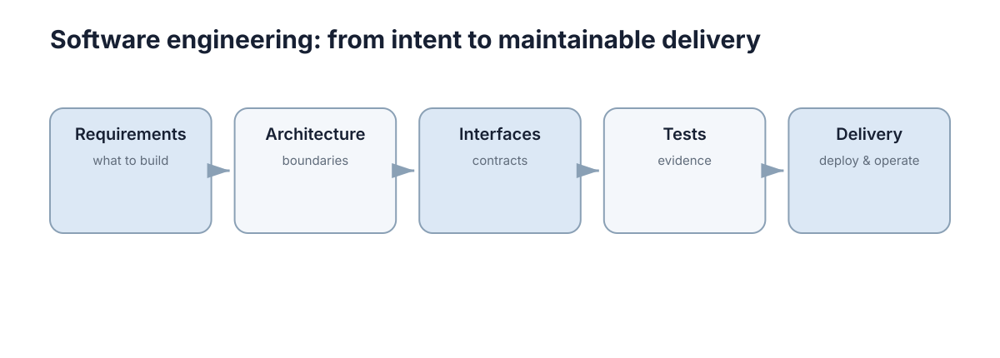

# Software Engineering

软件工程部分围绕科研和机器人项目真正需要的能力展开：需求与架构、模块与接口、版本控制、测试调试、容器部署。**这些内容之所以放在一起，是因为它们共同回答同一个问题：一个能跑起来的原型，怎样才能变成一个别人可以接手、几个月后还能改得动的系统。**

<figure markdown="span">
  
  <figcaption>Software Engineering 的核心概念关系。</figcaption>
</figure>

## 本节要解决的问题

研究型项目和课堂作业最大的差别，不在于代码量，而在于**代码需要被谁使用、使用多久**。一次性实验脚本可以只有一个文件、没有测试、硬编码路径；而一个要交给下一届学生、要继续发论文、要在实机上反复运行的系统，必须处理完全不同的要求。

本节要解决的正是从“能跑”到“可维护、可交付”之间的落差，具体包括五类问题：

- **需求说不清**：想做的东西边界模糊，功能与质量要求混在一起，导致代码结构随讨论反复摇摆；
- **模块拆不开**：所有逻辑写在一个脚本里，改一处要重新理解全部；
- **接口靠记忆**：模块之间靠口头约定的字段名、单位和坐标系传递数据，换个人就出错；
- **改动不可追溯**：改了哪些文件、为什么改、能不能退回上一个可用状态，全靠回忆；
- **部署靠现场操作**：换一台机器就起不来，出问题只能翻终端里已经滚过去的输出。

这五类问题有一个共同特征：它们在项目早期几乎不产生成本，在项目中后期集中爆发。所以本节的目标不是让你在第一天就搭建完整工程体系，而是让你知道**在什么阶段该引入哪种工程手段**，以及每种手段到底在解决什么。

本节允许出现代码，因为工程概念只有落到具体命令和目录结构上才有意义；但代码是手段不是目的——本节的重点始终是判断，而不是语法。

## 五章的推进逻辑

五章之间的关系是一条从“想清楚”到“跑得住”的直线，每一章都以前一章的产物为输入。

**第一阶段：需求与架构（[第 1 章](01-requirements-architecture.md)）。** 先回答“系统必须完成什么、哪些质量不能牺牲”，再把这些要求变成模块边界与依赖方向。这一阶段的产出不是代码，而是边界：系统做什么、不做什么，谁依赖谁。

**第二阶段：模块与接口（[第 2 章](02-modular-apis.md)）。** 边界确定之后，需要把它固化成可被调用的接口：函数签名、数据结构、错误约定。接口是模块之间唯一的合法通道，接口清楚，模块才能独立开发和独立测试。

**第三阶段：版本控制（[第 3 章](03-version-control.md)）。** 有了模块划分，就需要记录系统如何一步步演化：提交粒度、分支策略、评审流程。版本控制不只是备份，它是让多人协作和事后追溯成为可能的基础设施。

**第四阶段：测试与调试（[第 4 章](04-testing-debugging.md)）。** 前两章定义了“正确的行为”，这一章把它变成可自动执行的检查，并给出定位故障的方法。测试把推测变成证据，调试把现象缩小到根因。

**第五阶段：部署与可靠性（[第 5 章](05-deployment-reliability.md)）。** 最后要面对真实运行环境：环境一致性、自动检查流水线、健康检查、故障退化与回滚。到这里，“能跑”才变成“能一直跑”。

这条链条也可以反向使用：当你在后期遇到某个反复出现的麻烦，通常能沿链条往上找到缺失的环节。反复出现的接口错误，往往是第 1 章的边界没定清；反复出现的协作冲突，往往是第 3 章的提交与评审约定缺失。

## 概念地图

软件地图这张图把整节的骨架压缩成五个节点，它们不是并列的清单，而是一条有依赖顺序的链条。

**顶层标题 “Software engineering: from intent to maintainable delivery”** 给出了这条链的两端：起点是 intent（意图，即人想做什么），终点是 maintainable delivery（可维护的交付，即系统能被持续修改和运行）。中间的所有概念，都是把意图翻译成可交付物的工具。

**Requirements — what to build。** 第一个节点负责回答“要建什么”。它的关键词是 *what*，而不是 *how*；一旦这里滑向技术选型，说明需求还没被真正想清楚。这一节点的产出是明确的功能范围、质量指标和验收条件。

**Architecture — boundaries。** 第二个节点负责划边界。架构的核心动作是决定哪些东西放在一起、哪些东西分开、谁可以不依赖谁。它的关键词是 *boundaries*，这也解释了为什么架构讨论经常表现为争论“这个功能属于哪个模块”，而不是“用哪个框架”。

**Interfaces — contracts。** 第三个节点把边界变成契约。契约的特点是可验证：字段名、单位、错误码、超时语义都必须写下来，而不是靠口头约定。接口一旦稳定，模块内部就可以自由重构，这是整个工程体系里最重要的杠杆点之一。

**Tests — evidence。** 第四个节点提供证据。它把契约和需求变成可执行的检查，让“我觉得没问题”变成“检查证明没问题”。注意图中的用词是 *evidence* 而不是 *verification*，强调测试的价值在于为判断提供依据，而不是追求形式上的覆盖。

**Delivery — deploy & operate。** 最后一个节点指向运行：部署与运维。它提醒读者整个链条并没有在代码合入时就结束，系统的可靠性是在运行中持续被验证的，因此交付必须包含观察、诊断和恢复能力。

顺着这五个节点读，可以得到一条完整的判断链：**想清楚要什么 → 划出边界 → 写下契约 → 用证据检查 → 交付并持续观察**。任何一环缺失，后面所有环节的成本都会上升。

## 与其他章节的接口

本章的概念不是自成一体的，它们会作为工具出现在其它章节的语境里。下表给出几个最主要的衔接点：

| 工程概念 | 用在哪一章 | 解决什么问题 |
| --- | --- | --- |
| 接口契约 | [ROS 2 与 DDS 中间件](../distributed-systems/05-middleware-ros2-dds.md) | 话题、QoS 与消息类型约定不一致导致通信失败 |
| 模块边界与依赖方向 | [网络与消息](../distributed-systems/01-network-messaging.md) | 跨进程调用中的超时、重试与幂等设计 |
| 测试与回归 | [Sim2Real / Real2Sim](../simulation-sim2real/04-sim2real-real2sim.md) | 仿真与实机行为差异需要可复现的验证手段 |
| 测试与 CI | [模型、运动学与动力学](../robotics/01-models-kinematics-dynamics.md) | 标定参数的回归验证需要自动化检查 |
| 安全退化设计 | [容错设计](../robustness-safety/04-fault-tolerance.md) | 故障时系统行为必须可控而不是随机 |
| 版本控制与发布 | [导航与控制](../robotics/05-navigation-control.md) | 参数与控制器逻辑变更需要可追溯、可回退 |
| 可观测性与运行时约束 | [安全学习与运行时](../robustness-safety/05-safe-learning-runtime.md) | 学习策略上线后需要持续监控与干预能力 |

这些接口说明了本节的定位：它提供的是**跨章节通用的工程基础设施**。当你在其它章节遇到“为什么仿真好好的、实机就失败”这类问题时，多半要回到本章的接口契约、测试与可观测性上找答案。

## 工程实践的最低基线

工程实践很容易变成两种极端：要么完全不讲，要么一开始就上全套重流程。更现实的方式是按项目规模设定最低基线——先保证不会因为缺哪一环而崩，再逐步加码。

| 项目规模 | 必须做到 | 可以暂时不做 |
| --- | --- | --- |
| 一个人 | 用 Git 且每个有意义改动一次提交；脚本有明确入口与参数；关键计算函数有少量断言 | 完整 CI、容器化、监控告警 |
| 三个人 | 分支与评审约定；模块接口写下来；自动化测试与静态检查进入 CI；依赖版本锁定 | 多环境灰度、SLO 与错误预算 |
| 一个团队 / 长期运行 | 上述全部，加上容器化部署、健康检查、日志与指标、错误预算与回滚流程；接口契约随版本管理 | 暂无——降级只会把成本推给未来的运维 |

这张表的关键判断是：**成本不是消失了，而是被推迟了**。一个人做原型时不写测试是合理的权衡；但同一个项目如果要交给别人继续做，那么“暂时不做”的那一格就会立刻变成必须做的事。基线的选择应当由“这段代码还要活多久、还有谁来碰”决定，而不是由个人偏好决定。

## 本章导航

- [第 1 章 · 需求、边界与软件架构](01-requirements-architecture.md)：从功能与质量要求出发，定义系统边界与依赖方向。
- [第 2 章 · 模块化设计与 API](02-modular-apis.md)：把边界固化为接口契约，让模块可以独立开发与验证。
- [第 3 章 · 版本控制与 Git](03-version-control.md)：用提交、分支与评审记录系统如何演化。
- [第 4 章 · 测试与调试](04-testing-debugging.md)：用测试提供证据，用系统化流程定位故障。
- [第 5 章 · 容器、部署与可靠运行](05-deployment-reliability.md)：让系统在不同机器上可复现地启动，并且可以被观察和回退。

> **下一步**：从 [需求、边界与软件架构](01-requirements-architecture.md) 开始，按顺序读完五章；如果正在调试跨模块问题，可以直接跳到 [测试与调试](04-testing-debugging.md)，再结合 [ROS 2 与 DDS 中间件](../distributed-systems/05-middleware-ros2-dds.md) 检查接口契约。
