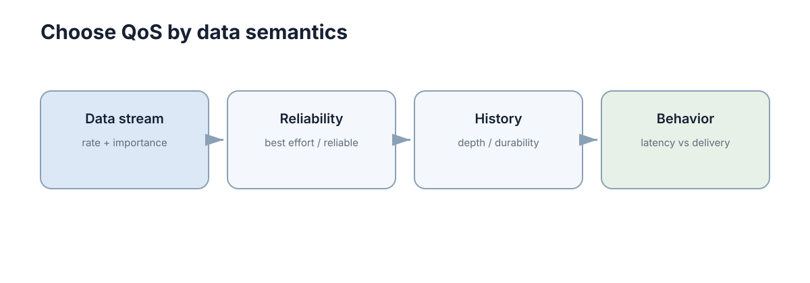

# DDS & ROS2

> 先澄清最容易误解的一点：ROS 的全名是 Robot Operating System，但它并不是 Ubuntu、Windows 那种负责进程调度、内存管理和硬件驱动的内核级操作系统。
>
> 更准确地说，ROS 是一套运行在 Linux 等操作系统之上的机器人软件框架：它规定模块怎样拆成节点、节点怎样交换消息、坐标系怎样管理、程序怎样启动、数据怎样记录，并提供大量现成工具和机器人软件包。ROS2 又把这些能力建立在 DDS 等通信中间件之上。
>
> 所以理解 ROS，不应该从背 `ros2 topic list` 开始，而应该先问：**一台机器人为什么需要这么一层软件基础设施？**

<figure markdown="span">
  
  <figcaption>ROS2 的通信最终会落到底层 QoS：不同数据需要不同的传输语义。</figcaption>
</figure>

## 一、先从一台不用 ROS 的机器人开始

假设要做一辆最简单的移动机器人，只完成四件事：

1. 激光雷达不断产生距离数据；
2. 定位程序根据雷达和里程计估计机器人位置；
3. 规划程序根据当前位置与目标点生成路径；
4. 控制程序把路径变成左右轮速度。
如果所有代码都写在一个 Python/C++ 程序里，最开始确实很方便：
`读取雷达 → 算位置 → 规划 → 算速度 → 写串口`
但很快会遇到第一个问题：四个模块的运行频率根本不同。
假设雷达 10 Hz，定位 50 Hz，规划 2 Hz，底盘控制 100 Hz。若把它们塞进一个顺序循环，规划一次耗时 200 ms，就会让本来应该每 10 ms 更新一次的控制器一起停 200 ms。
这不是“代码写得慢”，而是**不同任务不应该被绑在同一个执行节奏里**。
于是自然会把它们拆成多个进程：

- 雷达驱动进程；
- 定位进程；
- 规划进程；
- 控制进程。
拆开以后，第二个问题立刻出现：这些进程怎么交换数据？
最直接的办法是自己写 TCP/UDP。可是这又会带来一串额外工作：

- 谁负责分配 IP 和端口？
- 一个雷达数据同时给定位和避障两个程序时，是开两个连接还是转发？
- 新启动的节点怎样找到发布者？
- 数据结构升级后怎么保证两边类型一致？
- 多台机器之间怎么通信？
- 某个模块重启后，其它模块是否必须重启？
- 如何查看现在系统里到底有哪些通信连接？
这些问题与“机器人算法”本身无关，却会占掉大量开发时间。
ROS 就是在这里被需要的：**它把机器人程序之间反复出现的通信、发现、类型、坐标系、启动、记录和调试问题抽成统一基础设施。**
可以先记住一句最重要的话：

> ROS 的核心价值不是“提供某个算法”，而是让很多独立机器人模块能够按照统一接口组成一个系统。

## 二、ROS 与真正操作系统是什么关系

一台运行 ROS2 的机器人通常至少有四层。

| 层 | 典型内容 | 负责什么 |
|---|---|---|
| 硬件 | CPU、网卡、串口、雷达、电机 | 真实计算和物理执行 |
| 操作系统 | Linux 内核、Ubuntu、设备驱动、进程调度 | 管理硬件、内存、线程和文件 |
| ROS2 基础设施 | rcl、rclcpp/rclpy、RMW、DDS、TF2、Launch | 模块通信、发现、坐标、启动、工具 |
| 机器人应用 | SLAM、Nav2、感知、规划、控制 | 完成具体机器人功能 |
因此，当一个 ROS 节点“卡住”时，原因可能来自完全不同的层：

- USB 雷达掉线：硬件/驱动层；
- 进程 CPU 占满：操作系统调度层；
- 话题 QoS 不兼容：ROS/DDS 层；
- A* 找不到路径：应用算法层。
如果把 ROS 当成一个黑盒“操作系统”，排错时很容易跨层乱改。
例如 `/scan` 没数据时直接去改 SLAM 参数，就是典型的层级错误。正确顺序应该先确认设备存在，再确认驱动节点存在，再确认 `/scan` 是否发布，最后才看 SLAM 是否订阅成功。

### ROS2 内部也不是一层

从上往下可以继续拆成：

| 层 | 常见名字 | 作用 |
|---|---|---|
| 应用 API | `rclcpp`、`rclpy` | C++ / Python 写节点时直接使用 |
| ROS Client Library 公共层 | `rcl` | 把不同语言的公共行为统一 |
| RMW | ROS Middleware interface | 把 ROS API 与具体中间件隔离 |
| DDS/RTPS | Fast DDS、Cyclone DDS 等 | 发现、序列化、网络传输、QoS |
| OS / Network | UDP、共享内存、网卡 | 最终执行数据传输 |
这里的关键不是记名字，而是理解“可替换边界”。
应用程序通常只写 `rclcpp` 或 `rclpy`；它不应该直接依赖某一家 DDS 的私有 API。这样底层 DDS 实现可以更换，而上层节点逻辑尽量不变。
这也是 RMW（ROS Middleware）存在的原因：**它是一层适配接口，把 ROS 与具体 DDS 实现解耦。**

## 三、Node：为什么 ROS 要把功能拆成节点

ROS 中最基本的运行单元叫 Node，中文通常称“节点”。
节点不是一台机器，也不是一个线程，更不是一个 Topic。
它更像是“一个有名字、能够参与 ROS 通信的功能模块”。
例如一辆车可以有：

| 节点 | 主要职责 | 典型输入 | 典型输出 |
|---|---|---|---|
| `lidar_driver` | 读取雷达 | USB/串口 | `/scan` |
| `wheel_odom` | 计算轮式里程计 | 编码器 | `/odom` |
| `localization` | 估计位姿 | `/scan`、`/odom` | `/pose` |
| `planner_server` | 规划路径 | 地图、目标、位姿 | Path |
| `controller_server` | 跟踪路径 | Path、位姿 | `/cmd_vel` |
| `base_driver` | 驱动底盘 | `/cmd_vel` | 电机串口指令 |
为什么不直接把这些功能写成库函数？
因为机器人系统里最重要的不是“函数能被调用”，而是各模块可以**独立运行、独立重启、独立部署、独立观测**。
如果雷达节点崩溃，理想情况是只重启雷达驱动，而不是整个导航系统一起退出。

### 节点与进程不是一一对应

零基础最容易形成的错误印象是：

> 一个 Node = 一个 Linux 进程。

ROS2 并不要求这样。
常见情况有两种：

- 一个进程只运行一个节点，边界清晰，容易隔离故障；
- 一个进程装入多个组件节点，减少进程间通信和复制开销。
后者称为 component composition（组件组合）。
所以应该区分三个概念：

- Node：ROS 逻辑模块；
- Process：操作系统进程；
- Thread：进程中的执行线程。
它们属于不同层级。

## 四、ROS Graph：节点为什么能“自动找到”彼此

当多个节点开始运行后，会形成 ROS Graph，也就是“ROS 计算图”。
图中的节点不是靠你手工写死 `192.168.1.10:5000` 才连接，而是通过底层发现机制交换信息。
图中至少包含：

- 哪些节点存在；
- 哪些节点发布哪些 Topic；
- 哪些节点订阅哪些 Topic；
- 有哪些 Service；
- 有哪些 Action；
- 各接口使用什么消息类型；
- 通信端点的 QoS 是否兼容。
例如控制器订阅 `/odom` 时，它表达的是：

> “我要接收名字为 `/odom`、类型匹配且 QoS 兼容的数据。”

它不需要知道里程计发布者在哪个进程、哪台电脑上。
这就是 ROS 的位置解耦。

### 名字相同不等于一定通信

两端能够真正连起来，至少要满足：

1. 名称匹配；
2. 消息类型匹配；
3. DDS discovery 能互相发现；
4. QoS 兼容；
5. 网络链路可达。
所以 `ros2 topic list` 看到了 `/scan`，并不能证明你的订阅回调一定能收到扫描数据。
这也是 ROS 调试中非常重要的思维：**“能发现接口”和“数据真正能够流动”是两件事。**

## 五、Topic、Service、Action 与 Parameter 为什么要分开

假设机器人系统里有四种需求：

- 雷达每 100 ms 发一帧数据；
- 用户偶尔请求“清空地图”；
- 用户发送“导航到 A 点”，任务可能持续 30 秒；
- 控制器的最大速度设为 0.6 m/s。
如果只提供一种“消息”机制，也能勉强实现，但每个需求的交互语义完全不同。
ROS 因此提供四类常用接口。

| 原语 | 交互形式 | 什么时候结束 | 能否持续反馈 | 能否取消 | 典型用途 |
|---|---|---|---|---|---|
| Topic | 发布/订阅 | 不结束，持续流动 | 本身就是持续数据 | 不适用 | `/scan`、`/odom`、`/cmd_vel` |
| Service | 请求/响应 | 返回一次响应后结束 | 否 | 通常不作为长任务取消机制 | 清零、查询、触发 |
| Action | goal/feedback/result | 任务完成后结束 | 是 | 是 | 导航、机械臂抓取 |
| Parameter | 节点配置 | 配置被读写 | 可监听变化 | 不适用 | 增益、阈值、最大速度 |

### Topic：没有“谁调用谁”的持续数据流

Topic 最适合持续产生的数据。
雷达驱动只负责不断发布 `/scan`，并不需要知道谁在使用它。
今天可以只有 SLAM 订阅，明天再启动一个避障节点，两者都能同时得到数据，雷达驱动无需修改。
这就是发布/订阅（publish/subscribe）的扇出能力。

### Service：一次问题，一次答案

Service 适合边界明确、耗时较短的操作。
例如“保存地图是否成功？”天然对应一个请求和一个结果。
如果一个操作需要几十秒，用 Service 就会遇到问题：调用者在等待期间不知道进度，也很难优雅取消。

### Action：为什么导航不能只用 Service

“导航到目标点”至少有三个阶段：

1. 发送目标；
2. 运行期间不断得到进度；
3. 最终成功、失败或取消。
Action 就是为这种长任务设计的。
可以把它记成：
`Goal → Feedback → Result`
并且 Goal 还能被取消或抢占。

### Parameter：配置不应该偷偷写死在代码里

假设最大速度从 0.4 m/s 改成 0.6 m/s。
如果这个数字散落在 C++ 源码里，每次修改都要重新编译；如果它是参数，就可以由 YAML 或启动文件注入。
参数的核心作用不是“方便调参”，而是把**程序逻辑**与**运行配置**分离。

## 六、Message / Service / Action 类型就是模块之间的合同

ROS 不只要求 Topic 名称相同，还要求消息类型相同。
例如 `/cmd_vel` 常使用 `geometry_msgs/msg/Twist`。
一个 Twist 中包含线速度和角速度。对移动底盘，常见约定是：

- `linear.x`：前进速度，单位 m/s；
- `angular.z`：绕竖直轴旋转的角速度，单位 rad/s。
看起来只是两个数字，但真正的接口合同还包含：

- 单位是什么；
- 坐标轴方向是什么；
- 时间戳表示采样时刻还是发送时刻；
- 数据多久更新一次；
- 缺失一帧时接收端怎么办；
- 哪些值属于非法值。
因此消息结构只是“语法”，字段语义才是“合同”。

```python
# Topic：持续发布带明确单位的速度命令
cmd = Twist()
cmd.linear.x = 0.4       # m/s
cmd.angular.z = -0.2     # rad/s
velocity_publisher.publish(cmd)

# Service：一次请求、一次响应
future = reset_client.call_async(Trigger.Request())
future.add_done_callback(handle_reset_result)
```

上面的代码体现了两种不同关系：速度命令是持续数据流，重置操作有明确请求和结果。

### 为什么自定义消息不能随便改

假设一个消息原来有字段 `distance_m`，后来开发者为了“方便”让它改成毫米，但字段名不变。
编译可能完全通过，所有节点也仍然能通信，但数值会放大 1000 倍。
这类错误比类型不匹配更危险，因为系统会**稳定地做错事**。
所以接口变更时至少遵守两条：

1. 改单位或改语义，要视为破坏性变更；
2. 新增字段应尽量提供明确默认行为，让旧消费者仍能工作。

## 七、TF2：为什么机器人必须有统一坐标系

ROS 系统里另一个几乎无处不在的基础设施是 TF2。
想象雷达检测到一个障碍物在它前方 2 m。
这个“前方 2 m”是相对于雷达坐标系说的，不是相对于地图。
如果雷达安装在机器人前方 0.25 m，而机器人本体又位于地图坐标 `(3.0, 1.0)`，规划器必须把这些坐标关系串起来，才能知道障碍物在地图中的位置。
移动机器人中常见一条链：
`map → odom → base_link → laser`
每一条箭头都表示一个坐标变换。
可以把它理解成：

- `map`：长期全局参考；
- `odom`：短时间连续但会漂移的里程计参考；
- `base_link`：机器人本体；
- `laser`：雷达安装位置。

### 为什么同时要 map 和 odom

只用一个全局坐标系看起来更简单，但 SLAM/定位算法可能突然修正累计漂移。
例如机器人根据轮速认为自己在 `x=10.4 m`，回环后发现实际上应是 `x=9.8 m`。
若直接让控制器看到 0.6 m 的瞬间跳变，它可能产生剧烈控制动作。
ROS 导航栈常通过 `map → odom` 吸收全局校正，而 `odom → base_link` 保持短期连续。
这实际上是在同时满足两个需求：

- 全局位置长期不能无限漂移；
- 控制所用局部位姿短时间不能突然跳。

### TF 不只关心空间，还关心时间

如果图像是 10:00:00.100 采到的，却拿 10:00:00.300 的机器人位姿去变换，机器人高速运动时会出现明显空间误差。
假设机器人速度为 1 m/s，时间错位 200 ms，则仅平移误差就可能达到

$$
1\times0.2=0.2\ \text{m}.
$$

所以 TF 查询本质上是：

> “在某个时间点，frame A 到 frame B 的变换是多少？”

这也是为什么时间戳错误经常表现成“坐标系问题”。

## 八、Package、Workspace、colcon 与 overlay 到底是什么

很多初学者第一次接触 ROS2 时，最困惑的不是算法，而是目录结构。
先从最小单位开始。

### Package：可编译、可安装、可复用的软件单元

一个 ROS package 通常包含：

- 节点源码；
- `package.xml`：包的名字、版本、依赖等元数据；
- C++ 包常有 `CMakeLists.txt`；
- Python 包常有 `setup.py` / `setup.cfg`；
- 可选的 launch、config、URDF、msg 等资源。
Package 更像“一个可独立构建和安装的模块”，而不是一个任意文件夹。

### Workspace：一组一起开发的 Package

典型 ROS2 workspace 会出现四个关键目录：

| 目录 | 作用 | 是否手工写代码 |
|---|---|---|
| `src/` | 源码包 | 是 |
| `build/` | 构建中间文件 | 否 |
| `install/` | 安装后的可执行文件与环境脚本 | 否 |
| `log/` | colcon 构建日志 | 否 |
真正应该版本管理的主要是 `src/` 和必要配置，而不是 `build/`、`install/`、`log/`。

### colcon 做了什么

`colcon build` 不等于“编译一个 cpp 文件”。
它会读取 workspace 中各 package 的依赖关系，然后按依赖顺序构建，并把结果安装到 `install/`。
例如：
`msgs_pkg → localization_pkg → navigation_pkg`
若后两个包依赖第一个自定义消息包，colcon 会先处理消息包。

### source 为什么必不可少

构建结束后，当前 shell 并不会自动知道新包安装在哪里。
执行 `source install/setup.bash` 的本质，是把这个 workspace 的包路径、库路径和环境信息加入当前 shell。
所以一个常见错误是：

> 明明刚刚 build 成功，`ros2 run` 却说找不到包。

第一件事不是重新编译，而是检查当前终端有没有 source 对应环境。

### underlay 与 overlay

假设先加载系统 ROS2 Humble：
`/opt/ros/humble`
再加载自己的 workspace：
`~/robot_ws/install`
系统 ROS 是 underlay，自己的 workspace 是 overlay。
overlay 中同名资源可以覆盖 underlay。
这很强大，也很危险：如果连续 source 多个互相依赖、甚至互相引用的 workspace，最终环境变量会非常难推理。
因此应把“当前 shell 到底 source 了什么”当成 ROS 环境的一部分，而不是无关细节。

## 九、Launch、Lifecycle 与 Composition 解决的是系统启动问题

节点多到十几个以后，一个个打开终端执行命令就不可维护了。
Launch 文件解决的是：

- 一次启动多个节点；
- 给节点传参数；
- remap 名称；
- 按条件启动；
- 组织 namespace；
- 组合多个 launch 文件。
所以 Launch 不是单纯的“快捷启动脚本”，它描述的是一份系统运行拓扑。

### Remap 为什么重要

假设一个通用避障节点订阅 `/scan`，但某台车的雷达发布 `/lidar_scan`。
可以选择改源码，也可以启动时把接口 remap：
`/scan ← /lidar_scan`
后者保持了节点本身的通用性。

### Namespace 解决多机器人重名

如果三辆车都发布 `/odom`，直接放进同一个 ROS 图会产生名字冲突和语义混乱。
可以使用 namespace：

- `/rover1/odom`；
- `/rover2/odom`；
- `/rover3/odom`。
这不是简单“加前缀”，而是在同一 ROS 图中建立清晰的命名边界。

### Lifecycle：为什么“进程活着”不等于“节点可工作”

一些 ROS2 节点具有 lifecycle（生命周期）状态，例如：
`unconfigured → inactive → active → finalized`
一个导航节点进程可能已经存在，但还没进入 active 状态，因此不会真正处理业务。
这解决了系统启动顺序问题：先加载配置和资源，确认依赖满足，再统一激活。
否则 20 个节点同时启动时，谁先初始化完成完全由机器负载决定，系统行为就会带有偶然性。

### Composition：把多个节点放进同一进程

跨进程通信通常需要序列化、复制和调度。
如果相机 30 Hz、每帧 1920×1080×3 字节，单帧约 6.2 MB，每秒原始数据约

$$
6.2\times30\approx186\ \text{MB/s}.
$$

高带宽链路上，复制本身就可能成为瓶颈。
把紧密耦合的节点组合到同一个进程，并配合进程内通信，可以减少部分复制开销。
代价是故障隔离变差：一个进程崩溃，里面所有组件都一起退出。

## 十、Executor、Callback 与 spin：节点里的代码究竟什么时候执行

很多人会写 ROS2 回调，却没有真正理解是谁在调用回调。
节点里常见事件包括：

- Topic 收到新消息；
- Timer 到期；
- Service 收到请求；
- Action 状态变化；
- Future 完成。
这些事件不是各自凭空创建线程执行。
ROS2 中 Executor（执行器）负责等待事件，并调度对应 callback（回调函数）。
`spin` 可以粗略理解为：

> “让执行器持续等待 ROS 事件，并在事件到来时执行对应回调。”

### 一个长回调为什么能拖死整个节点

假设单线程执行器里有两个回调：

- 控制定时器：每 10 ms 一次；
- 规划回调：一次计算 80 ms。
如果规划回调开始执行，单线程 Executor 在这 80 ms 内无法同时执行控制回调。
本应 100 Hz 的控制会直接错过约 8 个周期。
所以“Topic 发布频率是 100 Hz”并不代表订阅回调真的以 100 Hz 被执行。
中间还隔着：
`消息到达 → 等待队列 → Executor 调度 → Callback 执行`

### 多线程也不是自动变快

MultiThreadedExecutor 允许多个回调并发，但是否真的能并发，还受 callback group、共享资源和锁影响。
如果两个回调都争同一把 mutex，多线程最终仍会串行。
更糟的是，如果缺少正确同步，还会出现数据竞争。
因此执行器设计要回答三个问题：

1. 哪些回调必须低延迟？
2. 哪些回调可能耗时很长？
3. 哪些回调访问同一份状态？
只有这三个问题清楚以后，单线程、多线程和 callback group 的选择才有依据。

## 十一、DDS 与 RMW：ROS2 的消息到底怎样跨进程和跨机器

现在再看 DDS，就不会把它误认为 ROS2 的全部。
ROS2 上层负责 Node、Topic、Service、Action 等统一概念；RMW 把这些概念映射到底层中间件；DDS/RTPS 再负责发现、数据分发与 QoS。
因此发送一条 Topic 数据，可以把路径粗略理解为：
`你的节点 → rclcpp/rclpy → rcl → rmw → DDS → 网络/共享内存 → DDS → rmw → 对端节点`
这条链解释了两个常见现象。
第一，ROS2 通信不是本地函数调用，即使节点在同一台电脑上，也存在调度和中间件开销。
第二，ROS2 可以跨机器，因为底层并不要求发布者和订阅者位于同一个进程或同一主机。

### QoS 为什么不是“高级选项”

先回到开头的例子。
相机 30 Hz，每 33 ms 出一帧。控制器通常只关心最新帧。
如果网络短暂堵塞 1 秒，积压 30 帧，再按顺序慢慢处理，控制器看到的会一直是过去的数据。
这时“不丢数据”反而比“丢掉旧数据”更糟。
相反，急停状态一小时可能只出现一次，却不能因为一个瞬时丢包永远消失。
因此 QoS 不是单纯追求“更可靠”，而是在回答：

> **丢一条与晚一条，哪一种代价更大？**

| 策略 | 直觉 | 典型用途 |
|---|---|---|
| Reliability | 要不要确认与重传 | 关键事件 vs 高频传感器 |
| History | 保存最近若干还是全部 | 状态流 vs 事件流 |
| Depth | 队列最多留多少条 | 决定积压上限 |
| Durability | 后加入者能否拿到旧值 | 地图、静态状态 |
| Deadline | 多久没更新算异常 | 周期数据健康检查 |
| Liveliness | 如何判断发布者仍活着 | 故障检测 |

### Reliability：可靠不等于实时

RELIABLE 会尽力确认与重传丢失样本；BEST_EFFORT 更愿意接受丢失，让最新数据继续向前流动。
如果一个 20 Hz 雷达订阅者卡住 0.5 s，它落后约 10 帧。
对实时避障来说，恢复后处理这 10 帧旧扫描通常没有意义。
所以高频传感器经常更偏向“新鲜度”，关键状态更偏向“完整性”。

### Depth：为什么队列大可能更危险

设发布频率 100 Hz，而消费者暂时只能处理 80 Hz。
队列以每秒 20 条的速度增长。
Depth=100 时，理论上约 5 秒才装满，但代价是消费者可能一直处理几秒以前的数据。
对控制而言，这种“没有丢包但数据很旧”的状态比直接丢旧数据更难发现。

### Durability：为什么后启动的节点可能拿不到地图

VOLATILE 表示只接收订阅建立之后的新数据。
TRANSIENT_LOCAL 允许发布端保留最近样本，让后加入订阅者也能获得当前状态。
如果一张静态地图只发布一次，而规划器晚 10 秒才启动，纯 VOLATILE 就可能导致规划器永远等不到那张已经发过的地图。

### QoS 兼容性

发布者和订阅者名字、类型都正确，QoS 仍可能让它们无法匹配。

| 发布端 | 订阅端 | 结果 |
|---|---|---|
| RELIABLE | RELIABLE | 兼容 |
| RELIABLE | BEST_EFFORT | 兼容 |
| BEST_EFFORT | RELIABLE | 不兼容 |
| TRANSIENT_LOCAL | VOLATILE | 兼容 |
| VOLATILE | TRANSIENT_LOCAL | 不兼容 |
可以把规则理解为：**发布端实际提供的能力必须满足订阅端要求的最低能力。**

## 十二、多机、Domain ID、发现与容器为什么经常出问题

ROS2 多机通信能工作，是因为 DDS discovery 会让参与者互相发现。
这一步通常依赖局域网组播以及随后建立的数据通道。
因此两台机器“能 ping 通”只是必要条件之一，不代表 ROS2 一定能互相发现。

### Domain ID 是逻辑隔离边界

ROS2 可以通过 `ROS_DOMAIN_ID` 把同一物理网络划成不同逻辑域。
同一 Domain 的参与者会尝试互相发现；不同 Domain 通常彼此不可见。
所以两台电脑网络完全正常，但一个是 Domain 0、一个是 Domain 20，它们会表现得像“ROS2 网络坏了”。

### 多机最常见的五类问题

| 现象 | 第一嫌疑 | 原因 |
|---|---|---|
| 完全看不到另一台机器 | Domain / 组播 / 防火墙 | discovery 未建立 |
| 能看到节点但没数据 | QoS / 类型 / 端口 | endpoint 未匹配或数据通道受阻 |
| 多网卡时偶尔能通 | DDS 选错网卡 | 宣告了不可达地址 |
| VPN 打开后突然失效 | 路由或组播变化 | discovery 走错接口 |
| Docker 内看不到宿主机 | NAT / multicast | 容器网络改变可达性 |

### 为什么 Docker 对 ROS2 特别容易制造错觉

普通 Web 服务经常只需要映射一个固定端口，例如 8080。
DDS discovery 和数据通信不是这种简单的“单端口服务器”模型。
容器的 NAT、虚拟网卡、组播转发都可能影响发现。
所以排查容器中的 ROS2 通信时，必须把两件事分开：

1. 容器里的节点是否正常运行；
2. 容器的网络拓扑是否允许 DDS 发现和数据传输。
否则很容易把网络隔离误判成节点代码错误。

## 十三、ROS2 命令行不是背诵题，而是一套观测工具

常用命令应该按“我要回答什么问题”来记。

| 你想知道什么 | 常用命令 | 它回答的问题 |
|---|---|---|
| 现在有哪些节点 | `ros2 node list` | ROS Graph 中谁活着 |
| 一个节点有哪些接口 | `ros2 node info /name` | 它发布、订阅、服务什么 |
| 有哪些 Topic | `ros2 topic list -t` | 名称和类型是什么 |
| 某 Topic 谁在发、谁在收 | `ros2 topic info /scan -v` | endpoint 与 QoS 如何 |
| 数据实际长什么样 | `ros2 topic echo /odom` | 字段值是否正确 |
| 发布频率 | `ros2 topic hz /scan` | 是否达到预期周期 |
| 带宽 | `ros2 topic bw /image` | 是否吃满链路 |
| 有哪些 Service | `ros2 service list -t` | 可调用的短请求 |
| 有哪些 Action | `ros2 action list -t` | 可执行的长任务 |
| 参数有哪些 | `ros2 param list /node` | 节点可配置项 |
| TF 关系 | `ros2 run tf2_tools view_frames` | 坐标树是否连通 |
正确的使用方式不是“出问题后每个命令都敲一遍”，而是先提出一个可证伪的问题。
例如导航没有速度输出，可以依次问：

1. `controller_server` 节点是否存在？
2. 它是否处于 active？
3. 它是否订阅到了路径和位姿？
4. `/cmd_vel` 是否真的发布？
5. `/cmd_vel` 频率是否稳定？
6. 底盘节点是否订阅并执行？
每一步都把故障范围缩小一层。

### rosbag2：把“现场”带回来

机器人故障往往只在实机上偶发出现。
rosbag2 可以记录 Topic，在之后回放。
它的意义不仅是保存数据，而是把一次不可重复的现场变成可以反复分析的输入。
例如一次定位突然跳变，可以同时记录：

- `/scan`；
- `/imu/data`；
- `/odom`；
- `/tf`、`/tf_static`；
- 定位输出。
回放后就能判断是原始传感器异常、TF 错误，还是定位算法本身的问题。

## 十四、用 Nav2 看懂一个真实 ROS2 系统怎样拼起来

理解 ROS 最有效的方法，不是再背一遍概念，而是看一个完整系统。
Nav2 是 ROS2 中典型的移动机器人导航栈。
把细节先压缩，一次“去目标点”的数据链可以理解为：
`传感器 → 定位 → 地图/代价地图 → 全局规划 → 局部控制 → /cmd_vel → 底盘`
其中每一步通常由不同节点完成。

### 目标是怎样流动的

用户发送一个导航 Action goal。
BT Navigator（行为树导航器）组织任务流程，再调用 planner server 得到全局路径，controller server 根据实时位姿跟踪路径并不断输出速度命令。
这时前面学过的 ROS 概念会同时出现：

| ROS 概念 | 在 Nav2 中的具体作用 |
|---|---|
| Node | planner、controller、map_server 等独立模块 |
| Topic | `/odom`、`/scan`、`/cmd_vel` 等持续数据 |
| Service | 清理 costmap 等短操作 |
| Action | NavigateToPose 等长任务 |
| Parameter | 规划器、控制器和 costmap 配置 |
| TF2 | `map → odom → base_link → sensor` |
| Lifecycle | 控制各导航节点何时真正 active |
| Launch | 一次启动整套导航栈 |
| DDS/QoS | 节点间通信与多机发现 |
因此 Nav2 不是“一个导航程序”，而是一组 ROS2 组件按照接口协作形成的系统。

### 一个错误为什么会跨很多节点传播

假设 `base_link → laser` 的 TF 平移写错 0.3 m。
雷达本身仍会正常发布，SLAM 也仍会运行，规划器甚至可能正常出路径。
但障碍物会在地图中整体偏移，costmap 位置错误，最终表现成“控制器贴墙”或“路径莫名无解”。
这说明 ROS 系统的调试不能只看最后出错的节点。
要沿数据链反推：
`执行异常 ← 控制参考 ← 规划结果 ← 地图/位姿 ← TF/传感器`

## 十五、ROS1 与 ROS2：名字相似，但系统假设已经变化

ROS1 与 ROS2 的核心概念有延续，例如 Node、Topic、Service、Package 都很熟悉，但通信架构发生了重要变化。

| 方面 | ROS1 | ROS2 |
|---|---|---|
| 发现中心 | 依赖 ROS Master | 基于 DDS 等分布式发现 |
| 通信底层 | ROS 自定义 TCPROS/UDPROS | RMW + DDS/RTPS 等 |
| QoS | 选择较少 | reliability、durability、deadline 等可配置 |
| 实时性设计 | 不是主要目标 | 更重视可控延迟与实时场景 |
| Lifecycle | 非统一核心机制 | 有标准 lifecycle node |
| 多机器人隔离 | namespace / master 等方式 | namespace + Domain 等机制 |
| 参数 | 有中心参数服务器 | 参数属于各节点 |
| 构建体系 | catkin | ament + colcon |
最重要的理解不是“ROS2 比 ROS1 新”，而是它们对分布式系统的假设不同。
ROS1 中很多工具围绕中心 Master 组织；ROS2 则更强调去中心发现、中间件抽象和通信 QoS。
所以从 ROS1 迁到 ROS2 时，真正需要重新理解的通常是：

- discovery；
- QoS；
- lifecycle；
- executor；
- 参数模型；
- colcon/ament；
- 多机与 DDS 网络行为。

## 十六、把常见故障按层反查，才算真正理解 ROS

ROS 最容易学成“会启动，不会排错”。
下面这张表比记更多命令更重要。

| 现象 | 优先检查层 | 第一个问题 |
|---|---|---|
| `ros2 run` 找不到包 | 环境/Workspace | 当前 shell source 了哪个 `setup.bash`？ |
| 节点列表里没有程序 | 进程/启动 | 进程是否真的存活？ |
| Topic 名字存在但收不到 | ROS Graph / QoS | 类型和 QoS 是否匹配？ |
| 单机正常，多机失效 | DDS/网络 | Domain、组播、防火墙、网卡是否一致？ |
| TF lookup 失败 | TF2 | 两 frame 是否有完整链，时间点是否可查？ |
| 控制周期忽快忽慢 | Executor / CPU | 是否有长 callback 阻塞？ |
| 地图能显示但规划报错 | TF/Costmap/配置 | 地图、机器人 footprint 和坐标是否一致？ |
| 导航节点存在却不工作 | Lifecycle | 是否已经 active？ |
| 参数改了却没效果 | 参数/Launch | 实际运行节点拿到的参数值是什么？ |
| Docker 外正常、容器内失败 | 网络 | DDS discovery 是否穿过容器网络？ |
可以把整套排查固定成六层：

1. **硬件**：设备是否存在；
2. **进程**：程序是否活着；
3. **ROS Graph**：节点与接口是否存在；
4. **通信**：类型、QoS、DDS、网络是否匹配；
5. **语义**：时间戳、坐标系、单位是否正确；
6. **算法**：最后才怀疑 SLAM、规划或控制算法。

这个顺序不能颠倒。
因为算法层的症状经常只是下层错误传播上来的结果。

### 本章最后只需要真正记住五句话

第一，**ROS 不是 Linux 那种操作系统，而是机器人软件基础设施。** Linux 管进程、线程、内存和驱动；ROS 管机器人模块怎样组织与协作。
第二，**Node 是功能边界，Topic/Service/Action 是不同的交互语义。** 不要把所有通信都当成“发消息”。
第三，**TF 和时间是机器人数据的坐标语义。** 数值正确但 frame 或 timestamp 错，结果仍然是错的。
第四，**ROS2 通信下面还有 RMW 与 DDS。** QoS、发现、多机网络问题都来自这一层，不能只看应用代码。
第五，**会用 ROS 的标准不是会启动 launch，而是能沿“硬件 → 进程 → Graph → 通信 → 语义 → 算法”把问题定位到正确层。**

> **下一步**：通信为什么会丢、重复、延迟，见 [Networks & Message Passing](01-network-messaging.md)；多机时间与时间戳为何会影响 TF 和融合，见 [Time & Asynchrony](02-distributed-time.md)；把 ROS2 放进完整机器人闭环，见 [Navigation & Control](../../robotics-perception/robotics/05-navigation-control.md)；坐标系和位姿本身的数学基础，见 [Models, Kinematics & Dynamics](../../robotics-perception/robotics/01-models-kinematics-dynamics.md)。
